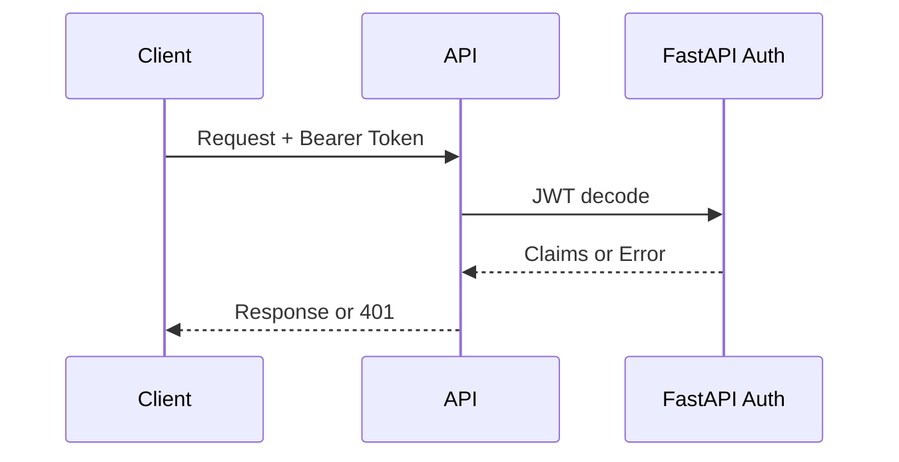
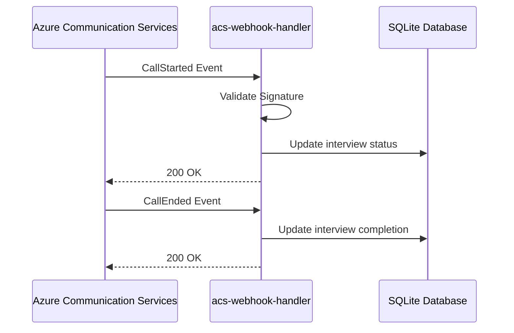

# Talenti API Reference

> **Version:** 1.0.0  
> **Last Updated:** January 2026  
> **Base URL:** `http://localhost:8000`

## Overview

Talenti's backend is powered by FastAPI. All endpoints require authentication unless otherwise specified.

---

## Table of Contents

1. [Authentication](#authentication)
2. [Rate Limiting](#rate-limiting)
3. [Core Routes](#core-routes)
4. [AI & Platform Routes](#ai--platform-routes)
   - [acs-token-generator](#acs-token-generator)
   - [acs-webhook-handler](#acs-webhook-handler)
   - [ai-interviewer](#ai-interviewer)
   - [azure-speech-token](#azure-speech-token)
   - [create-organisation](#create-organisation)
   - [data-retention-cleanup](#data-retention-cleanup)
   - [extract-requirements](#extract-requirements)
   - [generate-shortlist](#generate-shortlist)
   - [parse-resume](#parse-resume)
   - [score-interview](#score-interview)
   - [send-invitation](#send-invitation)
5. [Error Codes](#error-codes)
6. [Webhook Events](#webhook-events)

---

## Authentication

All authenticated endpoints require a valid JWT token in the Authorization header:

```http
Authorization: Bearer <jwt_token>
```

Tokens are obtained via `POST /api/auth/login` and validated with JWT verification in FastAPI.

### Authentication Flow



---

## Rate Limiting

All endpoints implement rate limiting to prevent abuse:

| Endpoint | Limit | Window |
|----------|-------|--------|
| acs-token-generator | 10 requests | 1 minute |
| ai-interviewer | 30 requests | 1 minute |
| azure-speech-token | 15 requests | 1 minute |
| extract-requirements | 20 requests | 1 minute |
| generate-shortlist | 10 requests | 5 minutes |
| parse-resume | 5 requests | 1 minute |
| score-interview | 10 requests | 5 minutes |

Rate limit headers returned on 429 responses:

```http
Retry-After: <seconds>
```

---

## Core Routes

### POST /api/auth/register

Create a new user.

**Request Body:**
```json
{
  "email": "user@example.com",
  "password": "strong-password",
  "full_name": "Ada Lovelace"
}
```

**Response:**
```json
{
  "id": "user-uuid",
  "email": "user@example.com",
  "full_name": "Ada Lovelace",
  "created_at": "2026-01-13T12:00:00Z"
}
```

### POST /api/auth/login

Authenticate and receive an access token. Refresh token is set as httpOnly cookie.

**Request Body:**
```json
{
  "email": "user@example.com",
  "password": "strong-password"
}
```

**Response:**
```json
{
  "access_token": "eyJ...",
  "token_type": "bearer"
}
```

### GET /api/auth/me

Return current user profile.

### POST /api/orgs

Create an organisation and assign the current user as admin.

**Request Body:**
```json
{
  "name": "Talenti",
  "description": "AI interview platform",
  "industry": "HR Tech",
  "website": "https://talenti.app"
}
```

### POST /api/roles

Create a job role for an organisation.

**Request Body:**
```json
{
  "organisation_id": "org-uuid",
  "title": "Senior Frontend Engineer",
  "description": "Role description"
}
```

### POST /api/invitations

Create an interview invitation.

**Request Body:**
```json
{
  "application_id": "app-uuid",
  "candidate_email": "candidate@example.com",
  "expires_at": "2026-01-13T12:00:00Z"
}
```

### POST /api/storage/upload-url

Request a SAS upload URL for Azure Blob Storage.

**Request Body:**
```json
{
  "organisation_id": "org-uuid",
  "file_name": "resume.pdf",
  "content_type": "application/pdf"
}
```

---

## AI & Platform Routes

### acs-token-generator

Generate Azure Communication Services tokens for video/voice calls.

**Endpoint:** `POST /api/v1/acs/token`

**Authentication:** Required

**Request Body:**
```json
{
  "scopes": ["voip"]  // Optional, defaults to ["voip"]
}
```

**Response:**
```json
{
  "token": "eyJ...",
  "expiresOn": "2026-01-13T12:00:00.000Z",
  "user": {
    "communicationUserId": "8:acs:..."
  }
}
```

**Errors:**

| Status | Description |
|--------|-------------|
| 401 | Unauthorized - invalid or missing token |
| 429 | Rate limit exceeded |
| 500 | AZURE_ACS_CONNECTION_STRING not configured |

**Required Secrets:**
- `AZURE_ACS_CONNECTION_STRING`

---

### acs-webhook-handler

Handle Azure Communication Services Event Grid webhooks.

**Endpoint:** `POST /api/v1/acs/webhook`

**Authentication:** Webhook signature verification (no JWT)

**Supported Events:**
- `Microsoft.EventGrid.SubscriptionValidationEvent`
- `Microsoft.Communication.CallStarted`
- `Microsoft.Communication.CallEnded`
- `Microsoft.Communication.ParticipantAdded`
- `Microsoft.Communication.ParticipantRemoved`
- `Microsoft.Communication.RecordingFileStatusUpdated`
- `Microsoft.Communication.PlayCompleted`
- `Microsoft.Communication.PlayFailed`
- `Microsoft.Communication.RecognizeCompleted`
- `Microsoft.Communication.RecognizeFailed`

**Request Body (Event Grid format):**
```json
[
  {
    "id": "event-id",
    "eventType": "Microsoft.Communication.CallStarted",
    "subject": "/calls/...",
    "data": {
      "serverCallId": "...",
      "correlationId": "uuid-format"
    },
    "eventTime": "2026-01-13T10:00:00Z"
  }
]
```

**Response:**
```json
{
  "success": true,
  "processed": 1
}
```

**Required Secrets:**
- `ACS_WEBHOOK_SECRET`
- `JWT_SECRET`

---

### ai-interviewer

Generate AI interviewer responses during interviews.

**Endpoint:** `POST /api/v1/interview/chat`

**Authentication:** Required

**Request Body:**
```json
{
  "messages": [
    { "role": "user", "content": "Hello, I'm here for the interview" }
  ],
  "jobTitle": "Senior Software Engineer",
  "companyName": "Acme Corp",
  "currentQuestionIndex": 0,
  "isPractice": false,
  "jobDescription": "We're looking for...",
  "requirements": {
    "skills": ["React", "TypeScript"],
    "experience": ["5+ years frontend"],
    "qualifications": ["Bachelor's degree"],
    "responsibilities": ["Lead frontend team"]
  },
  "orgValues": ["Innovation", "Collaboration"],
  "candidateContext": {
    "skills": ["React", "Node.js"],
    "experienceYears": 6,
    "recentRoles": ["Frontend Developer"]
  },
  "competenciesCovered": ["technical_skills"],
  "competenciesToCover": ["communication", "culture_fit"]
}
```

**Response:**
```json
{
  "message": "Welcome! I'm excited to learn more about your experience...",
  "detectedCompetencies": ["communication"]
}
```

**Rate Limits:**
- IP-based: 30 requests/minute
- User-based: 30 requests/minute

**Errors:**

| Status | Description |
|--------|-------------|
| 401 | Unauthorized |
| 402 | AI credits depleted |
| 429 | Rate limit exceeded |

**Required Secrets:**
- `AZURE_OPENAI_API_KEY`

---

### azure-speech-token

Generate Azure Speech Services tokens for speech-to-text and text-to-speech.

**Endpoint:** `POST /api/v1/speech/token`

**Authentication:** Required

**Response:**
```json
{
  "token": "eyJ...",
  "region": "australiaeast",
  "expiresIn": 600
}
```

**Required Secrets:**
- `AZURE_SPEECH_KEY`
- `AZURE_SPEECH_REGION`

---

### create-organisation

Create a new organisation and add the requesting user as admin.

**Endpoint:** `POST /api/orgs`

**Authentication:** Required

**Request Body:**
```json
{
  "name": "Acme Corporation",
  "industry": "Technology",
  "website": "https://acme.com",
  "description": "Leading tech company",
  "billing_email": "billing@acme.com"
}
```

**Response:**
```json
{
  "organisation": {
    "id": "uuid",
    "name": "Acme Corporation",
    "industry": "Technology",
    "website": "https://acme.com",
    "description": "Leading tech company",
    "billing_email": "billing@acme.com",
    "created_at": "2026-01-13T10:00:00Z",
    "updated_at": "2026-01-13T10:00:00Z"
  }
}
```

**Required Secrets:**
- `JWT_SECRET`

---

### data-retention-cleanup

Process data retention policies and deletion requests (scheduled job).

**Endpoint:** `POST /api/v1/data-retention/cleanup`

**Authentication:** None (internal service)

**Request Body:**
```json
{
  "action": "cleanup_recordings" | "process_deletion_requests"
}
```

**Response (cleanup_recordings):**
```json
{
  "success": true,
  "totalDeleted": 15,
  "organisationResults": [
    {
      "organisation": "Acme Corp",
      "retentionDays": 60,
      "interviewsProcessed": 5
    }
  ],
  "processedAt": "2026-01-13T10:00:00Z"
}
```

**Response (process_deletion_requests):**
```json
{
  "success": true,
  "requestsProcessed": 3,
  "results": [
    { "requestId": "uuid", "status": "completed" }
  ],
  "processedAt": "2026-01-13T10:00:00Z"
}
```

**Deletion Types:**
- `full_deletion` - Complete user data removal
- `recording_only` - Remove only interview recordings
- `anonymize` - Anonymize PII, retain aggregated data

---

### extract-requirements

Extract structured job requirements from job descriptions using AI.

**Endpoint:** `POST /api/v1/roles/extract-requirements`

**Authentication:** Required

**Request Body:**
```json
{
  "jobDescription": "We are looking for a Senior Engineer...",
  "jobTitle": "Senior Software Engineer"
}
```

**Response:**
```json
{
  "success": true,
  "requirements": {
    "skills": ["React", "TypeScript", "Node.js"],
    "experience": ["5+ years in frontend development"],
    "qualifications": ["Bachelor's in Computer Science"],
    "responsibilities": ["Lead frontend architecture"],
    "interviewQuestions": [
      "Describe a complex React project you've led...",
      "How do you approach code reviews?"
    ]
  }
}
```

---

### generate-shortlist

Generate AI-ranked candidate shortlist for a job role.

**Endpoint:** `POST /api/v1/shortlist/generate`

**Authentication:** Required (org member only)

**Request Body:**
```json
{
  "roleId": "uuid"
}
```

**Response:**
```json
{
  "matches": [
    {
      "applicationId": "uuid",
      "candidateId": "uuid",
      "matchScore": 85,
      "matchReasons": [
        "Strong React and TypeScript skills",
        "6 years relevant experience"
      ],
      "skills": ["React", "TypeScript", "Node.js"],
      "experience": "Senior Frontend Developer: Led team of 5...",
      "availability": "2 weeks notice",
      "workMode": "hybrid",
      "location": "NSW"
    }
  ],
  "roleTitle": "Senior Software Engineer"
}
```

**Authorization:** User must be a member of the organisation that owns the role.

---

### parse-resume

Parse uploaded CV/resume using AI to extract structured data.

**Endpoint:** `POST /api/v1/candidates/parse-resume`

**Authentication:** Required (own CV only)

**Request Body:**
```json
{
  "filePath": "user-id/resume.pdf",
  "userId": "user-id"
}
```

**Response:**
```json
{
  "success": true,
  "data": {
    "personal": {
      "first_name": "John",
      "last_name": "Doe",
      "email": "john@example.com",
      "phone": "+61 400 000 000",
      "linkedin_url": "https://linkedin.com/in/johndoe",
      "location": {
        "suburb": "Sydney",
        "state": "NSW",
        "postcode": "2000",
        "country": "Australia"
      }
    },
    "employment": [
      {
        "job_title": "Senior Developer",
        "company_name": "Tech Corp",
        "start_date": "2020-01-01",
        "end_date": null,
        "is_current": true,
        "description": "Led frontend team..."
      }
    ],
    "education": [
      {
        "institution": "University of Sydney",
        "degree": "Bachelor of Computer Science",
        "field_of_study": "Software Engineering",
        "end_date": "2015-12-01",
        "is_current": false
      }
    ],
    "skills": [
      { "skill_name": "React", "skill_type": "hard" },
      { "skill_name": "Leadership", "skill_type": "soft" }
    ],
    "summary": "Experienced software engineer with 10+ years..."
  }
}
```

**Security:**
- Users can only parse their own CV
- File path must match user ID prefix
- Path traversal protection enabled

---

### score-interview

Score a completed interview using AI analysis.

**Endpoint:** `POST /api/v1/scoring/analyze`

**Authentication:** None (service endpoint)

**Request Body:**
```json
{
  "interviewId": "uuid",
  "transcripts": [
    {
      "speaker": "ai",
      "content": "Tell me about yourself",
      "start_time_ms": 0
    },
    {
      "speaker": "candidate",
      "content": "I'm a software engineer with 6 years...",
      "start_time_ms": 5000
    }
  ],
  "jobTitle": "Senior Software Engineer",
  "jobDescription": "We're looking for...",
  "requirements": {
    "skills": ["React", "TypeScript"],
    "experience": ["5+ years"]
  },
  "orgValues": ["Innovation", "Teamwork"],
  "scoringRubric": {
    "technical_skills": { "weight": 0.3, "label": "Technical Skills" },
    "communication": { "weight": 0.2, "label": "Communication" }
  }
}
```

**Response:**
```json
{
  "success": true,
  "interviewId": "uuid",
  "dimensions": [
    {
      "dimension": "technical_skills",
      "score": 8.5,
      "weight": 0.3,
      "evidence": "Demonstrated deep React knowledge...",
      "cited_quotes": ["I've built complex state management..."]
    }
  ],
  "overall_score": 82,
  "narrative_summary": "The candidate demonstrated strong technical...",
  "candidate_feedback": "You showed excellent technical knowledge...",
  "anti_cheat_risk_level": "low",
  "anti_cheat_notes": "Response patterns consistent and natural"
}
```

**Default Scoring Dimensions:**
- vocabulary (10%)
- domain_knowledge (15%)
- technical_skills (20%)
- experience_depth (10%)
- communication (15%)
- culture_fit (10%)
- motivation (10%)
- confidence (10%)

---

### send-invitation

Send interview invitation email to a candidate.

**Endpoint:** `POST /api/invitations`

**Authentication:** Required (org recruiter/admin only)

**Request Body:**
```json
{
  "applicationId": "uuid",
  "candidateEmail": "candidate@example.com",
  "roleTitle": "Senior Software Engineer",
  "companyName": "Acme Corp",
  "expiresInDays": 7
}
```

**Response:**
```json
{
  "success": true,
  "invitationId": "uuid",
  "expiresAt": "2026-01-20T10:00:00Z"
}
```

**Authorization:**
- User must be org member with role: `admin`, `org_admin`, `recruiter`, or `hiring_manager`

**Required Secrets:**
- `RESEND_API_KEY`
- `SITE_URL` (defaults to production URL)

---

## Error Codes

### Standard HTTP Status Codes

| Status | Meaning |
|--------|---------|
| 200 | Success |
| 400 | Bad Request - invalid input |
| 401 | Unauthorized - missing/invalid token |
| 403 | Forbidden - insufficient permissions |
| 404 | Not Found |
| 405 | Method Not Allowed |
| 413 | Payload Too Large (>1MB for webhooks) |
| 429 | Too Many Requests - rate limited |
| 402 | Payment Required - AI credits depleted |
| 500 | Internal Server Error |

### Error Response Format

```json
{
  "error": "Human-readable error message",
  "retryAfter": 30  // Only on 429 responses
}
```

---

## Webhook Events

### Azure Communication Services Webhooks

The `acs-webhook-handler` endpoint receives Event Grid events from Azure.

**Webhook URL:** `POST /api/v1/acs/webhook`

**Configuration:**
1. Create Event Grid subscription in Azure Portal
2. Set endpoint to webhook URL
3. Configure `ACS_WEBHOOK_SECRET` for signature validation

**Event Flow:**



**Subscription Validation:**

Azure sends a validation event during setup:

```json
[{
  "eventType": "Microsoft.EventGrid.SubscriptionValidationEvent",
  "data": {
    "validationCode": "abc123"
  }
}]
```

The handler responds with:

```json
{
  "validationResponse": "abc123"
}
```

---

## SDK Usage Examples

### Frontend (React/TypeScript)

```typescript
import { apiClient } from "@/lib/apiClient";

// Call an API route
const { data } = await apiClient.post("/api/v1/interview/chat", {
  messages: [...],
  jobTitle: "Software Engineer",
  currentQuestionIndex: 0
});
```

### Handling Rate Limits

```typescript
async function callWithRetry(fn: () => Promise<any>, maxRetries = 3) {
  for (let i = 0; i < maxRetries; i++) {
    try {
      return await fn();
    } catch (error: any) {
      if (error.status === 429) {
        const retryAfter = parseInt(error.headers?.get('Retry-After') || '30');
        await new Promise(r => setTimeout(r, retryAfter * 1000));
        continue;
      }
      throw error;
    }
  }
}
```

---

## Appendix

### Required Environment Variables

| Variable | Description | Used By |
|----------|-------------|---------|
| `DATABASE_URL` | SQLite connection string | All functions |
| `JWT_SECRET` | JWT signing key | Authenticated endpoints |
| `AZURE_OPENAI_API_KEY` | Azure OpenAI key | AI functions |
| `AZURE_ACS_CONNECTION_STRING` | Azure Communication Services | ACS token routes |
| `ACS_WEBHOOK_SECRET` | Webhook signature secret | acs-webhook-handler |
| `AZURE_SPEECH_KEY` | Azure Speech Services key | azure-speech-token |
| `AZURE_SPEECH_REGION` | Azure Speech region | azure-speech-token |
| `RESEND_API_KEY` | Resend email API key | send-invitation |
| `SITE_URL` | Production site URL | send-invitation |
