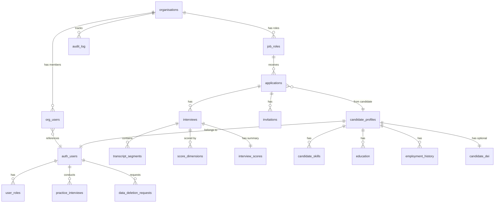
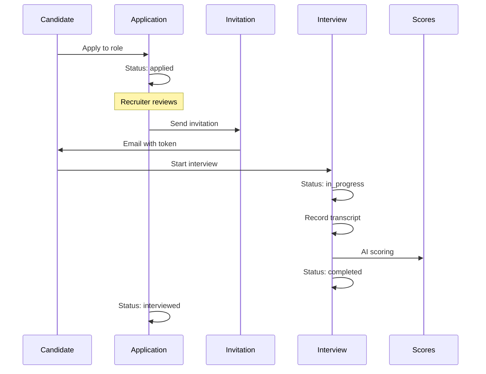
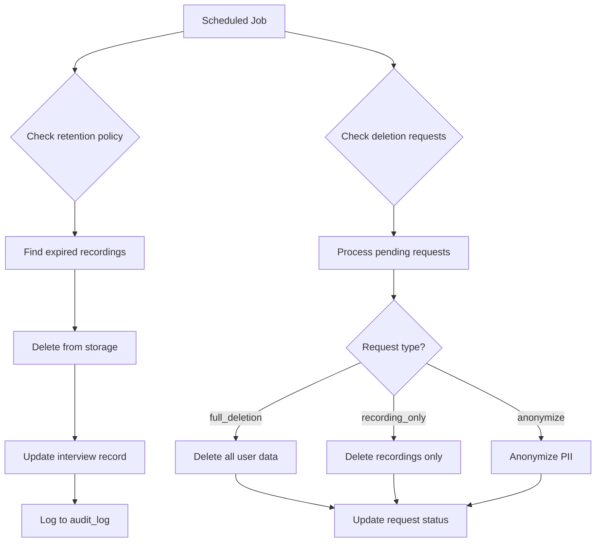

# Talenti Database Schema Documentation

> **Version:** 1.0.0  
> **Last Updated:** January 2026  
> **Database:** SQLite (FastAPI)

## Overview

This document provides comprehensive documentation of the Talenti database schema, including table structures, relationships, RLS policies, and data flow patterns.

---

## Table of Contents

1. [Entity Relationship Diagram](#entity-relationship-diagram)
2. [Tables](#tables)
3. [Enums](#enums)
4. [Functions](#functions)
5. [RLS Policy Summary](#rls-policy-summary)
6. [Data Flow Patterns](#data-flow-patterns)

---

## Entity Relationship Diagram



---

## Tables

### organisations

Company/business accounts that use the platform.

| Column | Type | Nullable | Default | Description |
|--------|------|----------|---------|-------------|
| id | uuid | NO | gen_random_uuid() | Primary key |
| name | text | NO | - | Organisation name |
| description | text | YES | NULL | About the organisation |
| industry | text | YES | NULL | Industry sector |
| website | text | YES | NULL | Company website URL |
| logo_url | text | YES | NULL | Logo image URL |
| billing_email | text | YES | NULL | Billing contact email |
| billing_address | text | YES | NULL | Billing address |
| values_framework | jsonb | YES | NULL | Company values for culture fit |
| recording_retention_days | integer | YES | NULL | How long to keep recordings |
| created_at | timestamptz | NO | now() | Creation timestamp |
| updated_at | timestamptz | NO | now() | Last update timestamp |

**Indexes:**
- `organisations_pkey` (id)

---

### org_users

Team members belonging to an organisation.

| Column | Type | Nullable | Default | Description |
|--------|------|----------|---------|-------------|
| id | uuid | NO | gen_random_uuid() | Primary key |
| organisation_id | uuid | NO | - | FK to organisations |
| user_id | uuid | NO | - | FK to auth.users |
| role | text | NO | 'member' | Role in org (admin, recruiter, viewer) |
| created_at | timestamptz | NO | now() | When added to org |

**Indexes:**
- `org_users_pkey` (id)
- `org_users_org_user_unique` (organisation_id, user_id) UNIQUE

**Foreign Keys:**
- `org_users_organisation_id_fkey` → organisations(id)

---

### job_roles

Open positions/job listings created by organisations.

| Column | Type | Nullable | Default | Description |
|--------|------|----------|---------|-------------|
| id | uuid | NO | gen_random_uuid() | Primary key |
| organisation_id | uuid | NO | - | FK to organisations |
| title | text | NO | - | Job title |
| description | text | YES | NULL | Full job description |
| department | text | YES | NULL | Department/team |
| location | text | YES | NULL | Work location |
| work_type | text | YES | NULL | remote/hybrid/onsite |
| employment_type | text | YES | NULL | full-time/part-time/contract |
| industry | text | YES | NULL | Industry category |
| salary_range_min | integer | YES | NULL | Minimum salary |
| salary_range_max | integer | YES | NULL | Maximum salary |
| requirements | jsonb | YES | NULL | Extracted requirements |
| scoring_rubric | jsonb | YES | NULL | Custom scoring weights |
| interview_structure | jsonb | YES | NULL | Interview configuration |
| status | job_role_status | NO | 'draft' | Role status |
| created_by | uuid | YES | NULL | User who created |
| created_at | timestamptz | NO | now() | Creation timestamp |
| updated_at | timestamptz | NO | now() | Last update timestamp |

**Requirements JSONB Structure:**
```json
{
  "skills": ["React", "TypeScript"],
  "experience": ["5+ years frontend"],
  "qualifications": ["Bachelor's degree"],
  "responsibilities": ["Lead frontend team"]
}
```

**Scoring Rubric JSONB Structure:**
```json
{
  "technical_skills": { "weight": 0.3, "label": "Technical Skills" },
  "communication": { "weight": 0.2, "label": "Communication" }
}
```

**Indexes:**
- `job_roles_pkey` (id)
- `job_roles_organisation_id_idx` (organisation_id)

**Foreign Keys:**
- `job_roles_organisation_id_fkey` → organisations(id)

---

### candidate_profiles

Candidate personal information and profile data.

| Column | Type | Nullable | Default | Description |
|--------|------|----------|---------|-------------|
| id | uuid | NO | gen_random_uuid() | Primary key |
| user_id | uuid | NO | - | FK to auth.users |
| first_name | text | YES | NULL | First name |
| last_name | text | YES | NULL | Last name |
| email | text | YES | NULL | Contact email |
| phone | text | YES | NULL | Phone number |
| suburb | text | YES | NULL | Suburb/city |
| state | text | YES | NULL | State/province |
| postcode | text | YES | NULL | Postal code |
| country | text | YES | NULL | Country |
| linkedin_url | text | YES | NULL | LinkedIn profile |
| portfolio_url | text | YES | NULL | Portfolio/website |
| cv_file_path | text | YES | NULL | Path to CV in storage |
| cv_uploaded_at | timestamptz | YES | NULL | When CV was uploaded |
| availability | text | YES | NULL | When available to start |
| work_mode | text | YES | NULL | Preferred work mode |
| work_rights | text | YES | NULL | Work authorization |
| gpa_wam | numeric | YES | NULL | Academic score |
| profile_visibility | text | YES | NULL | Visibility setting |
| visibility_settings | jsonb | YES | NULL | Detailed visibility |
| paused_at | timestamptz | YES | NULL | When paused job search |
| created_at | timestamptz | NO | now() | Creation timestamp |
| updated_at | timestamptz | NO | now() | Last update timestamp |

**Indexes:**
- `candidate_profiles_pkey` (id)
- `candidate_profiles_user_id_idx` (user_id) UNIQUE

---

### candidate_skills

Skills listed by candidates.

| Column | Type | Nullable | Default | Description |
|--------|------|----------|---------|-------------|
| id | uuid | NO | gen_random_uuid() | Primary key |
| user_id | uuid | NO | - | FK to auth.users |
| skill_name | text | NO | - | Skill name |
| skill_type | text | NO | - | hard/soft |
| proficiency_level | text | YES | NULL | beginner/intermediate/expert |
| created_at | timestamptz | NO | now() | Creation timestamp |

**Indexes:**
- `candidate_skills_pkey` (id)
- `candidate_skills_user_id_idx` (user_id)

---

### education

Educational history for candidates.

| Column | Type | Nullable | Default | Description |
|--------|------|----------|---------|-------------|
| id | uuid | NO | gen_random_uuid() | Primary key |
| user_id | uuid | NO | - | FK to auth.users |
| institution | text | NO | - | School/university name |
| degree | text | NO | - | Degree title |
| field_of_study | text | YES | NULL | Major/field |
| start_date | date | YES | NULL | Start date |
| end_date | date | YES | NULL | End/graduation date |
| is_current | boolean | YES | false | Currently studying |
| created_at | timestamptz | NO | now() | Creation timestamp |

**Indexes:**
- `education_pkey` (id)
- `education_user_id_idx` (user_id)

---

### employment_history

Work history for candidates.

| Column | Type | Nullable | Default | Description |
|--------|------|----------|---------|-------------|
| id | uuid | NO | gen_random_uuid() | Primary key |
| user_id | uuid | NO | - | FK to auth.users |
| company_name | text | NO | - | Employer name |
| job_title | text | NO | - | Position title |
| description | text | YES | NULL | Role description |
| start_date | date | NO | - | Start date |
| end_date | date | YES | NULL | End date (null if current) |
| is_current | boolean | YES | false | Currently employed |
| created_at | timestamptz | NO | now() | Creation timestamp |

**Indexes:**
- `employment_history_pkey` (id)
- `employment_history_user_id_idx` (user_id)

---

### candidate_dei

Diversity, equity, and inclusion data (optional, extra sensitive).

| Column | Type | Nullable | Default | Description |
|--------|------|----------|---------|-------------|
| id | uuid | NO | gen_random_uuid() | Primary key |
| user_id | uuid | NO | - | FK to auth.users |
| gender | text | YES | NULL | Gender identity |
| ethnicity | text | YES | NULL | Ethnic background |
| disability_status | text | YES | NULL | Disability disclosure |
| veteran_status | text | YES | NULL | Veteran status |
| created_at | timestamptz | NO | now() | Creation timestamp |

**Note:** This data is used only for aggregate DEI reporting, never for individual candidate evaluation.

---

### applications

Job applications from candidates.

| Column | Type | Nullable | Default | Description |
|--------|------|----------|---------|-------------|
| id | uuid | NO | gen_random_uuid() | Primary key |
| job_role_id | uuid | NO | - | FK to job_roles |
| candidate_id | uuid | NO | - | FK to auth.users (candidate) |
| status | text | NO | 'applied' | Application status |
| match_score | integer | YES | NULL | AI match score (0-100) |
| created_at | timestamptz | NO | now() | Application date |
| updated_at | timestamptz | NO | now() | Last update |

**Status Values:**
- `applied` - Initial application
- `screening` - Under review
- `invited` - Invited to interview
- `interviewing` - Interview in progress
- `interviewed` - Interview completed
- `shortlisted` - On shortlist
- `rejected` - Not proceeding
- `hired` - Offered/accepted

**Indexes:**
- `applications_pkey` (id)
- `applications_job_role_id_idx` (job_role_id)
- `applications_candidate_id_idx` (candidate_id)

**Foreign Keys:**
- `applications_job_role_id_fkey` → job_roles(id)

---

### interviews

Interview sessions.

| Column | Type | Nullable | Default | Description |
|--------|------|----------|---------|-------------|
| id | uuid | NO | gen_random_uuid() | Primary key |
| application_id | uuid | NO | - | FK to applications |
| status | interview_status | NO | 'invited' | Interview status |
| started_at | timestamptz | YES | NULL | When interview began |
| ended_at | timestamptz | YES | NULL | When interview ended |
| duration_seconds | integer | YES | NULL | Total duration |
| recording_url | text | YES | NULL | URL to recording |
| recording_deleted_at | timestamptz | YES | NULL | When recording deleted |
| anti_cheat_signals | jsonb | YES | NULL | Detected anomalies |
| metadata | jsonb | YES | NULL | Additional data |
| created_at | timestamptz | NO | now() | Creation timestamp |
| updated_at | timestamptz | NO | now() | Last update |

**Metadata JSONB Structure:**
```json
{
  "serverCallId": "...",
  "correlationId": "uuid",
  "lastEventAt": "2026-01-13T10:00:00Z"
}
```

**Indexes:**
- `interviews_pkey` (id)
- `interviews_application_id_idx` (application_id)

**Foreign Keys:**
- `interviews_application_id_fkey` → applications(id)

---

### transcript_segments

Interview transcript broken into speaker segments.

| Column | Type | Nullable | Default | Description |
|--------|------|----------|---------|-------------|
| id | uuid | NO | gen_random_uuid() | Primary key |
| interview_id | uuid | NO | - | FK to interviews |
| speaker | text | NO | - | 'ai' or 'candidate' |
| content | text | NO | - | Spoken text |
| start_time_ms | integer | NO | - | Start time in ms |
| end_time_ms | integer | YES | NULL | End time in ms |
| confidence | numeric | YES | NULL | STT confidence score |
| created_at | timestamptz | NO | now() | Creation timestamp |

**Indexes:**
- `transcript_segments_pkey` (id)
- `transcript_segments_interview_id_idx` (interview_id)
- `transcript_segments_start_time_idx` (start_time_ms)

**Foreign Keys:**
- `transcript_segments_interview_id_fkey` → interviews(id)

---

### interview_scores

Summary scoring for completed interviews.

| Column | Type | Nullable | Default | Description |
|--------|------|----------|---------|-------------|
| id | uuid | NO | gen_random_uuid() | Primary key |
| interview_id | uuid | NO | - | FK to interviews (UNIQUE) |
| overall_score | integer | YES | NULL | Weighted score (0-100) |
| narrative_summary | text | YES | NULL | AI-generated summary |
| candidate_feedback | text | YES | NULL | Feedback for candidate |
| anti_cheat_risk_level | text | YES | NULL | low/medium/high |
| scored_by | text | YES | NULL | 'ai' or user ID |
| model_version | text | YES | NULL | AI model used |
| prompt_version | text | YES | NULL | Prompt version |
| rubric_version | text | YES | NULL | Rubric version |
| human_override | boolean | YES | false | Manual adjustment made |
| human_override_by | uuid | YES | NULL | Who overrode |
| human_override_reason | text | YES | NULL | Why overridden |
| created_at | timestamptz | NO | now() | Creation timestamp |
| updated_at | timestamptz | NO | now() | Last update |

**Indexes:**
- `interview_scores_pkey` (id)
- `interview_scores_interview_id_idx` (interview_id) UNIQUE

**Foreign Keys:**
- `interview_scores_interview_id_fkey` → interviews(id)

---

### score_dimensions

Individual dimension scores for interviews.

| Column | Type | Nullable | Default | Description |
|--------|------|----------|---------|-------------|
| id | uuid | NO | gen_random_uuid() | Primary key |
| interview_id | uuid | NO | - | FK to interviews |
| dimension | text | NO | - | Dimension name |
| score | numeric | NO | - | Score (0-10) |
| weight | numeric | YES | NULL | Weight used (0-1) |
| evidence | text | YES | NULL | Explanation |
| cited_quotes | jsonb | YES | NULL | Supporting quotes |
| created_at | timestamptz | NO | now() | Creation timestamp |

**Default Dimensions:**
- vocabulary
- domain_knowledge
- technical_skills
- experience_depth
- communication
- culture_fit
- motivation
- confidence

**Indexes:**
- `score_dimensions_pkey` (id)
- `score_dimensions_interview_id_idx` (interview_id)

**Foreign Keys:**
- `score_dimensions_interview_id_fkey` → interviews(id)

---

### invitations

Interview invitations sent to candidates.

| Column | Type | Nullable | Default | Description |
|--------|------|----------|---------|-------------|
| id | uuid | NO | gen_random_uuid() | Primary key |
| application_id | uuid | NO | - | FK to applications |
| token | text | NO | - | Secure invite token |
| status | invitation_status | NO | 'pending' | Invitation status |
| email_template | text | YES | NULL | Template used |
| expires_at | timestamptz | NO | - | Expiration time |
| sent_at | timestamptz | YES | NULL | When email sent |
| opened_at | timestamptz | YES | NULL | When link clicked |
| created_at | timestamptz | NO | now() | Creation timestamp |

**Indexes:**
- `invitations_pkey` (id)
- `invitations_token_idx` (token) UNIQUE
- `invitations_application_id_idx` (application_id)

**Foreign Keys:**
- `invitations_application_id_fkey` → applications(id)

---

### practice_interviews

Practice interview sessions (not tied to real jobs).

| Column | Type | Nullable | Default | Description |
|--------|------|----------|---------|-------------|
| id | uuid | NO | gen_random_uuid() | Primary key |
| user_id | uuid | NO | - | FK to auth.users |
| sample_role_type | text | NO | - | Practice role category |
| status | text | NO | 'pending' | Session status |
| started_at | timestamptz | YES | NULL | Start time |
| ended_at | timestamptz | YES | NULL | End time |
| duration_seconds | integer | YES | NULL | Duration |
| feedback | jsonb | YES | NULL | Practice feedback |
| created_at | timestamptz | NO | now() | Creation timestamp |

---

### user_roles

Application-level role assignments.

| Column | Type | Nullable | Default | Description |
|--------|------|----------|---------|-------------|
| id | uuid | NO | gen_random_uuid() | Primary key |
| user_id | uuid | NO | - | FK to auth.users |
| role | app_role | NO | - | Role enum value |
| created_at | timestamptz | NO | now() | When assigned |

**Indexes:**
- `user_roles_pkey` (id)
- `user_roles_user_id_idx` (user_id)

---

### audit_log

Audit trail for security and compliance.

| Column | Type | Nullable | Default | Description |
|--------|------|----------|---------|-------------|
| id | uuid | NO | gen_random_uuid() | Primary key |
| user_id | uuid | YES | NULL | User who took action |
| organisation_id | uuid | YES | NULL | Related organisation |
| action | text | NO | - | Action type |
| entity_type | text | NO | - | What was affected |
| entity_id | uuid | YES | NULL | ID of affected entity |
| old_values | jsonb | YES | NULL | Before state |
| new_values | jsonb | YES | NULL | After state |
| ip_address | text | YES | NULL | Client IP |
| created_at | timestamptz | NO | now() | When action occurred |

**Indexes:**
- `audit_log_pkey` (id)
- `audit_log_organisation_id_idx` (organisation_id)
- `audit_log_created_at_idx` (created_at)

**Foreign Keys:**
- `audit_log_organisation_id_fkey` → organisations(id)

---

### data_deletion_requests

GDPR data deletion request tracking.

| Column | Type | Nullable | Default | Description |
|--------|------|----------|---------|-------------|
| id | uuid | NO | gen_random_uuid() | Primary key |
| user_id | uuid | NO | - | User requesting deletion |
| request_type | text | NO | 'full_deletion' | Type of deletion |
| status | text | NO | 'pending' | Request status |
| reason | text | YES | NULL | Why requesting |
| notes | text | YES | NULL | Processing notes |
| requested_at | timestamptz | NO | now() | Request time |
| processed_at | timestamptz | YES | NULL | Completion time |
| processed_by | text | YES | NULL | Who processed |

**Request Types:**
- `full_deletion` - Delete all data
- `recording_only` - Delete only recordings
- `anonymize` - Anonymize PII, keep aggregate data

**Status Values:**
- `pending` - Awaiting processing
- `processing` - Currently being processed
- `completed` - Successfully processed
- `failed` - Processing failed

---

## Enums

### app_role

Application-level roles.

```sql
CREATE TYPE app_role AS ENUM (
  'org_admin',
  'org_recruiter', 
  'org_viewer',
  'candidate'
);
```

### interview_status

Interview session states.

```sql
CREATE TYPE interview_status AS ENUM (
  'invited',
  'scheduled',
  'in_progress',
  'completed',
  'cancelled',
  'expired'
);
```

### invitation_status

Invitation states.

```sql
CREATE TYPE invitation_status AS ENUM (
  'pending',
  'sent',
  'delivered',
  'opened',
  'bounced',
  'expired'
);
```

### job_role_status

Job listing states.

```sql
CREATE TYPE job_role_status AS ENUM (
  'draft',
  'active',
  'paused',
  'closed'
);
```

---

## Functions

### user_belongs_to_org

Check if user is member of organisation.

```sql
CREATE FUNCTION user_belongs_to_org(_org_id uuid, _user_id uuid)
RETURNS boolean AS $$
  SELECT EXISTS (
    SELECT 1 FROM org_users 
    WHERE organisation_id = _org_id AND user_id = _user_id
  );
$$ LANGUAGE sql SECURITY DEFINER;
```

### user_org_role

Get user's role in organisation.

```sql
CREATE FUNCTION user_org_role(_org_id uuid, _user_id uuid)
RETURNS text AS $$
  SELECT role FROM org_users 
  WHERE organisation_id = _org_id AND user_id = _user_id;
$$ LANGUAGE sql SECURITY DEFINER;
```

### get_user_org_id

Get user's primary organisation.

```sql
CREATE FUNCTION get_user_org_id(_user_id uuid)
RETURNS uuid AS $$
  SELECT organisation_id FROM org_users 
  WHERE user_id = _user_id 
  LIMIT 1;
$$ LANGUAGE sql SECURITY DEFINER;
```

### has_role

Check if user has specific app role.

```sql
CREATE FUNCTION has_role(_role app_role, _user_id uuid)
RETURNS boolean AS $$
  SELECT EXISTS (
    SELECT 1 FROM user_roles 
    WHERE user_id = _user_id AND role = _role
  );
$$ LANGUAGE sql SECURITY DEFINER;
```

---

## RLS Policy Summary

| Table | SELECT | INSERT | UPDATE | DELETE |
|-------|--------|--------|--------|--------|
| organisations | Own org members | Service role | Org admins | - |
| org_users | Own org members | Service role | Org admins | Org admins |
| job_roles | Org members + public active | Org recruiters | Org recruiters | Org admins |
| candidate_profiles | Own + org with application | Own only | Own only | Own only |
| candidate_skills | Own + org with application | Own only | Own only | Own only |
| education | Own + org with application | Own only | Own only | Own only |
| employment_history | Own + org with application | Own only | Own only | Own only |
| candidate_dei | Own only | Own only | Own only | Own only |
| applications | Own + org members | Candidates | Org members | - |
| interviews | Own + org members | System | System | - |
| transcript_segments | Own + org members | System | - | - |
| interview_scores | Own + org members | System | Org admins | - |
| score_dimensions | Own + org members | System | - | - |
| invitations | Org members | Org recruiters | Org recruiters | - |
| practice_interviews | Own only | Own only | Own only | Own only |
| audit_log | Org admins | System | - | - |
| data_deletion_requests | Own only | Own only | System | - |

---

## Data Flow Patterns

### Candidate Application Flow



### Data Retention Flow


