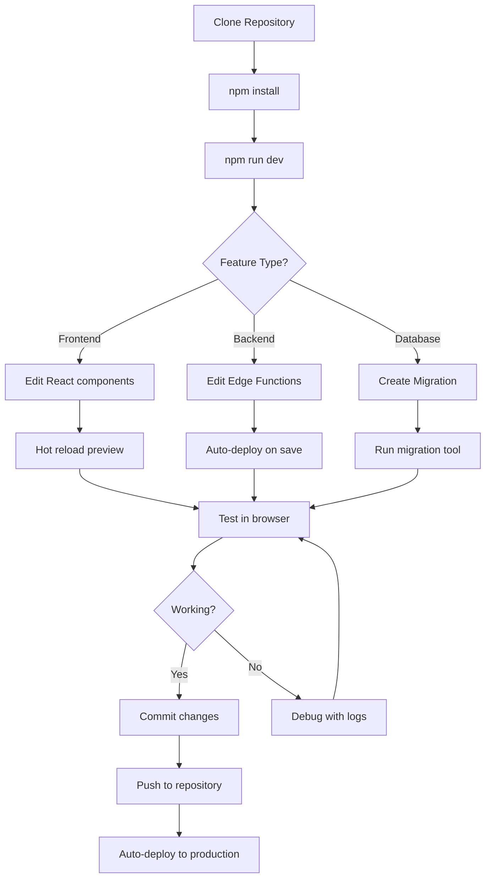

# Talenti Environment Setup Guide

> **Version:** 1.0.0  
> **Last Updated:** January 2026

## Overview

This guide provides step-by-step instructions for setting up a local development environment for the Talenti AI Interview Platform.

---

## Table of Contents

1. [Prerequisites](#prerequisites)
2. [Quick Start](#quick-start)
3. [Environment Variables](#environment-variables)
4. [Backend Setup (Lovable Cloud)](#backend-setup-lovable-cloud)
5. [Azure Services Setup](#azure-services-setup)
6. [Email Service Setup](#email-service-setup)
7. [Running the Application](#running-the-application)
8. [Troubleshooting](#troubleshooting)

---

## Prerequisites

### Required Software

| Software | Version | Purpose |
|----------|---------|---------|
| Node.js | 18.x or 20.x | JavaScript runtime |
| npm | 9.x+ | Package manager |
| Git | 2.x+ | Version control |
| Browser | Chrome/Edge/Firefox | Development & testing |

### Recommended Tools

- VS Code with extensions:
  - ESLint
  - Prettier
  - Tailwind CSS IntelliSense
  - TypeScript Vue Plugin (Volar)
- Postman or Insomnia (API testing)

### Check Versions

```bash
node --version  # Should be v18.x or v20.x
npm --version   # Should be v9.x or higher
git --version   # Any recent version
```

---

## Quick Start

```bash
# 1. Clone the repository
git clone <repository-url>
cd talenti

# 2. Install dependencies
npm install

# 3. Start development server
npm run dev

# 4. Open in browser
# Navigate to http://localhost:5173
```

The app will start with local defaults for basic development, but Azure credentials are required for full functionality.

---

## Environment Variables

### Frontend Configuration

These variables configure the React frontend:

| Variable | Description | Auto-configured |
|----------|-------------|-----------------|
| `VITE_API_BASE_URL` | FastAPI base URL | ✅ Yes |
| `VITE_AZURE_SPEECH_REGION` | Azure region for Speech (if needed client-side) | ⚠️ |
| `VITE_AZURE_ACS_RESOURCE` | ACS resource name (if needed client-side) | ⚠️ |

### Backend Secrets (FastAPI)

These secrets are configured in your environment or Azure Key Vault:

| Secret | Required | Description |
|--------|----------|-------------|
| `DATABASE_URL` | ✅ | SQLite path (e.g., `sqlite:///./data/app.db`) |
| `JWT_SECRET` | ✅ | JWT signing secret |
| `JWT_ISSUER` | ✅ | JWT issuer |
| `JWT_AUDIENCE` | ✅ | JWT audience |
| `AZURE_STORAGE_ACCOUNT` | ✅ | Azure Storage account name |
| `AZURE_STORAGE_ACCOUNT_KEY` | ✅ | Azure Storage account key for SAS |
| `AZURE_STORAGE_CONTAINER` | ✅ | Blob container name |
| `AZURE_STORAGE_SAS_TTL_MINUTES` | ✅ | SAS token TTL in minutes |
| `AZURE_ACS_CONNECTION_STRING` | ⚠️ | ACS connection string |
| `AZURE_SPEECH_KEY` | ⚠️ | Azure Speech Services key |
| `AZURE_SPEECH_REGION` | ⚠️ | Azure region (e.g., australiaeast) |
| `AZURE_OPENAI_ENDPOINT` | ✅ | Azure OpenAI endpoint |
| `AZURE_OPENAI_API_KEY` | ✅ | Azure OpenAI API key |
| `AZURE_OPENAI_DEPLOYMENT` | ✅ | Azure OpenAI deployment name |
| `ACS_WEBHOOK_SECRET` | ⚠️ | Webhook signature secret |
| `RESEND_API_KEY` | ⚠️ | Email service API key |
| `SITE_URL` | ⚠️ | Production URL |

**Legend:** ✅ Auto-configured | ⚠️ Manual setup required for full functionality

---

## Backend Setup

### Accessing the Backend

1. Ensure `DATABASE_URL` points to a local SQLite file path
2. Run the FastAPI app (see `backend/app/main.py`)

### Database Schema

The database schema is managed through migrations. Current tables:

- `organisations` - Company accounts
- `org_users` - Team memberships
- `job_roles` - Open positions
- `applications` - Candidate applications
- `interviews` - Interview sessions
- `candidate_profiles` - Candidate information
- `transcript_segments` - Interview transcripts
- `interview_scores` - AI scoring results
- `invitations` - Interview invites

### FastAPI Routes

API routes are implemented in `backend/app/api/` and mounted in `backend/app/main.py`.

---

## Azure Services Setup

### Azure Communication Services (ACS)

Required for video calling functionality.

#### 1. Create ACS Resource

1. Go to [Azure Portal](https://portal.azure.com)
2. Create new "Communication Services" resource
3. Select region closest to your users
4. Wait for deployment

#### 2. Get Connection String

1. Open your ACS resource
2. Go to "Keys" in the left menu
3. Copy "Connection string" (Primary)

#### 3. Configure Webhook

1. Go to "Events" in your ACS resource
2. Click "Event Subscription"
3. Set endpoint: `https://<your-api-host>/api/v1/acs/webhook`
4. Select events:
   - Microsoft.Communication.CallStarted
   - Microsoft.Communication.CallEnded
   - Microsoft.Communication.RecordingFileStatusUpdated

#### 4. Add to Backend Secrets

1. Add secret: `AZURE_ACS_CONNECTION_STRING` = your connection string
2. Add secret: `ACS_WEBHOOK_SECRET` = generated secret for webhook validation

### Azure Speech Services

Required for speech-to-text and text-to-speech.

#### 1. Create Speech Resource

1. Go to [Azure Portal](https://portal.azure.com)
2. Create new "Speech" resource (under Cognitive Services)
3. Select region: `australiaeast` (or nearest)
4. Select pricing tier: S0 (Standard)

#### 2. Get Keys

1. Open your Speech resource
2. Go to "Keys and Endpoint"
3. Copy "KEY 1"
4. Note the "Location/Region"

#### 3. Add to Lovable Secrets

1. Add secret: `AZURE_SPEECH_KEY` = your key
2. Add secret: `AZURE_SPEECH_REGION` = region (e.g., `australiaeast`)
3. Add secret: `AZURE_STORAGE_ACCOUNT_KEY` = storage account key

---

## Email Service Setup

### Resend Configuration

Required for sending interview invitation emails.

#### 1. Create Resend Account

1. Go to [resend.com](https://resend.com)
2. Sign up for free account
3. Verify your domain (optional for production)

#### 2. Get API Key

1. Go to API Keys section
2. Create new API key with send permissions
3. Copy the key

#### 3. Add to Lovable Secrets

1. Add secret: `RESEND_API_KEY` = your API key
2. Add secret: `SITE_URL` = your production URL (e.g., `https://talenti.lovable.app`)

---

## Running the Application

### Development Mode

```bash
# Start development server with hot reload
npm run dev
```

Opens at `http://localhost:5173`

### Build for Production

```bash
# Create production build
npm run build

# Preview production build locally
npm run preview
```

### Type Checking

```bash
# Run TypeScript type checking
npx tsc --noEmit
```

### Linting

```bash
# Run ESLint
npm run lint
```

---

## Troubleshooting

### Common Issues

#### "Supabase client not initialized"

**Cause:** Missing environment variables

**Solution:** 
- Ensure you're running from Lovable or have `.env` configured
- Check browser console for specific missing variables

#### "Failed to get ACS token"

**Cause:** Missing or invalid Azure credentials

**Solution:**
1. Verify `ACS_CONNECTION_STRING` is set in secrets
2. Check Azure portal that the ACS resource is active
3. Ensure connection string format is correct

#### "Speech recognition not working"

**Cause:** Missing Azure Speech credentials or browser permissions

**Solution:**
1. Verify `AZURE_SPEECH_KEY` and `AZURE_SPEECH_REGION` are set
2. Verify `AZURE_STORAGE_ACCOUNT_KEY` is set for SAS generation
2. Check browser has microphone permissions
3. Test in Chrome (best WebRTC support)

#### "Invitation emails not sending"

**Cause:** Missing or invalid Resend API key

**Solution:**
1. Verify `RESEND_API_KEY` is set
2. Check Resend dashboard for send logs
3. Ensure domain is verified for production

#### "Rate limit exceeded" (429 errors)

**Cause:** Too many requests in short time

**Solution:**
1. Wait for rate limit window to reset (usually 1 minute)
2. Implement exponential backoff in client code
3. Check if you're making duplicate requests

#### "AI credits depleted" (402 errors)

**Cause:** Lovable AI usage limit reached

**Solution:**
1. Check Lovable dashboard for credit status
2. Add more credits to your account
3. Optimize AI calls to reduce usage

#### Edge Function Deployment Issues

**Symptoms:** Functions return 404 or old code

**Solution:**
1. Trigger a save in Lovable to redeploy
2. Check Lovable Cloud logs for deployment errors
3. Verify function code compiles (no TypeScript errors)

### Debugging Tips

#### Check Console Logs

```typescript
// Edge function logs
console.log('Debug info:', { userId, data });
```

View in Lovable Cloud → Functions → Logs

#### Check Network Requests

1. Open browser DevTools (F12)
2. Go to Network tab
3. Filter by Fetch/XHR
4. Check request/response details

#### Database Queries

Use Lovable Cloud database viewer to:
- Check table contents
- Verify RLS policies
- Test queries

### Getting Help

1. Check existing documentation
2. Review error messages carefully
3. Check Lovable Cloud logs
4. Consult API_REFERENCE.md for endpoint details

---

## Appendix: Full Development Workflow



---

## Appendix: Configuration Files

### vite.config.ts

```typescript
import { defineConfig } from 'vite'
import react from '@vitejs/plugin-react'
import path from 'path'

export default defineConfig({
  plugins: [react()],
  resolve: {
    alias: {
      '@': path.resolve(__dirname, './src'),
    },
  },
  server: {
    port: 5173,
    open: true,
  },
})
```

### tsconfig.json (paths)

```json
{
  "compilerOptions": {
    "baseUrl": ".",
    "paths": {
      "@/*": ["./src/*"]
    }
  }
}
```

### tailwind.config.ts

Extends shadcn/ui defaults with custom design tokens. See `index.css` for CSS variable definitions.
