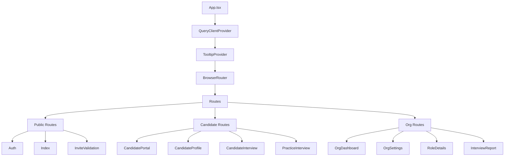
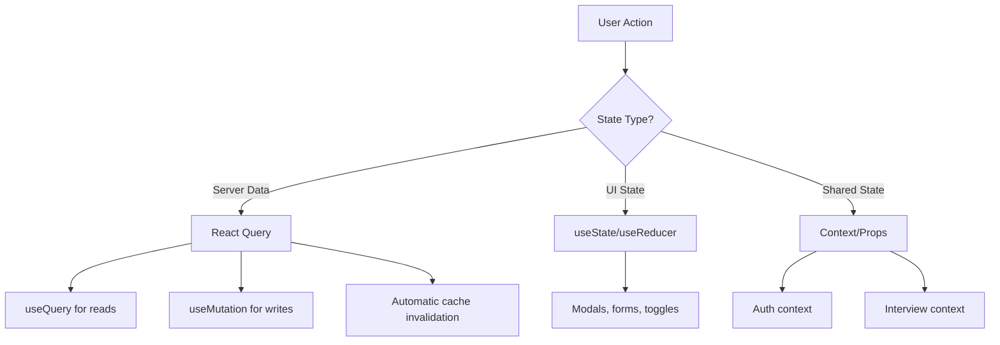
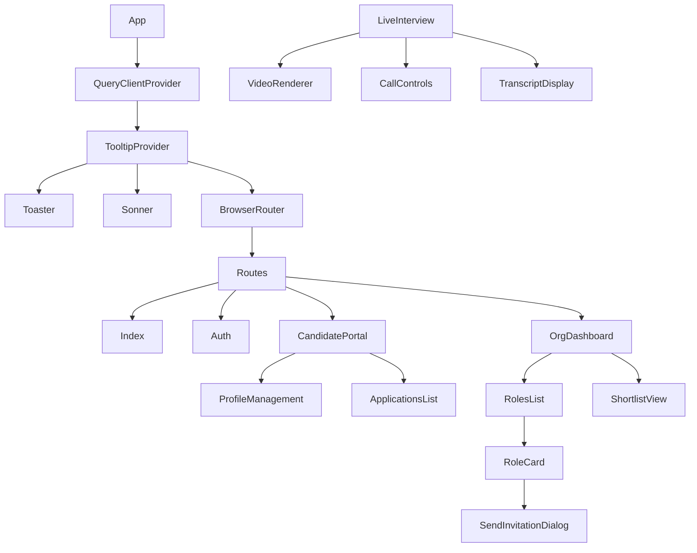

# Talenti Frontend Architecture Guide

> **Version:** 1.0.0  
> **Last Updated:** January 2026  
> **Stack:** React 18 + TypeScript + Vite + Tailwind CSS

## Overview

This guide documents the frontend architecture, component patterns, state management, and development conventions for the Talenti AI Interview Platform.

---

## Table of Contents

1. [Architecture Overview](#architecture-overview)
2. [Project Structure](#project-structure)
3. [Component Patterns](#component-patterns)
4. [State Management](#state-management)
5. [Routing](#routing)
6. [Form Handling](#form-handling)
7. [Styling Conventions](#styling-conventions)
8. [Hooks Library](#hooks-library)
9. [API Integration](#api-integration)
10. [Performance Patterns](#performance-patterns)

---

## Architecture Overview



### Technology Stack

| Layer | Technology |
|-------|------------|
| Framework | React 18 |
| Language | TypeScript 5 |
| Build | Vite |
| Styling | Tailwind CSS + shadcn/ui |
| State | React Query (TanStack Query) |
| Forms | React Hook Form + Zod |
| Routing | React Router v6 |
| Backend | Supabase (Lovable Cloud) |

---

## Project Structure

```
src/
├── components/           # Reusable components
│   ├── ui/              # shadcn/ui primitives
│   │   ├── button.tsx
│   │   ├── card.tsx
│   │   ├── dialog.tsx
│   │   └── ...
│   ├── AuditTrailViewer.tsx
│   ├── CallControls.tsx
│   ├── CandidateComparison.tsx
│   ├── ProfileManagement.tsx
│   ├── SendInvitationDialog.tsx
│   ├── ShortlistView.tsx
│   └── VideoRenderer.tsx
│
├── hooks/               # Custom React hooks
│   ├── use-mobile.tsx   # Responsive detection
│   ├── use-toast.ts     # Toast notifications
│   ├── useAcsCall.ts    # Azure Communication Services
│   ├── useAcsToken.ts   # ACS token management
│   ├── useAuditLog.ts   # Audit logging
│   ├── useAzureAvatar.ts # Azure avatar rendering
│   ├── useAzureSpeech.ts # Speech services
│   ├── useCandidateData.ts # Candidate CRUD
│   ├── useDeletionRequests.ts
│   ├── useInterviewContext.ts
│   ├── useInterviewPersistence.ts
│   ├── useInvitations.ts
│   ├── useOrgData.ts
│   ├── useShortlist.ts
│   ├── useSpeechRecognition.ts
│   └── useSpeechSynthesis.ts
│
├── integrations/        # External integrations
│   └── supabase/
│       ├── client.ts    # Supabase client
│       └── types.ts     # Generated types
│
├── lib/                 # Utility functions
│   ├── auditLog.ts
│   ├── generateInterviewReport.ts
│   ├── scoring.ts
│   └── utils.ts         # cn(), formatters
│
├── pages/               # Route components
│   ├── Auth.tsx
│   ├── CandidateInterview.tsx
│   ├── CandidatePortal.tsx
│   ├── CandidateProfile.tsx
│   ├── EditRoleRubric.tsx
│   ├── Index.tsx
│   ├── InterviewComplete.tsx
│   ├── InterviewLobby.tsx
│   ├── InterviewReport.tsx
│   ├── InviteValidation.tsx
│   ├── LiveInterview.tsx
│   ├── NewRole.tsx
│   ├── NotFound.tsx
│   ├── OrgDashboard.tsx
│   ├── OrgOnboarding.tsx
│   ├── OrgSettings.tsx
│   ├── PracticeInterview.tsx
│   ├── PracticeInterviewComplete.tsx
│   └── RoleDetails.tsx
│
├── App.tsx              # Root component
├── App.css              # Global styles
├── index.css            # Tailwind + design tokens
└── main.tsx             # Entry point
```

---

## Component Patterns

### Component File Structure

```typescript
// ComponentName.tsx

// 1. Imports (external, then internal)
import { useState, useEffect } from 'react';
import { useQuery } from '@tanstack/react-query';
import { Button } from '@/components/ui/button';
import { supabase } from '@/integrations/supabase/client';

// 2. Types/Interfaces
interface ComponentNameProps {
  userId: string;
  onComplete?: () => void;
}

// 3. Component definition
export function ComponentName({ userId, onComplete }: ComponentNameProps) {
  // 3a. Hooks (state, queries, effects)
  const [isLoading, setIsLoading] = useState(false);
  
  const { data, isLoading: queryLoading } = useQuery({
    queryKey: ['data', userId],
    queryFn: () => fetchData(userId),
  });
  
  // 3b. Event handlers
  const handleSubmit = async () => {
    // ...
  };
  
  // 3c. Render
  return (
    <div className="container mx-auto p-4">
      {/* JSX */}
    </div>
  );
}
```

### Container vs Presentational Components

```typescript
// Container: handles data/logic
function CandidateProfileContainer() {
  const { profile, isLoading, updateProfile } = useCandidateData();
  
  if (isLoading) return <Skeleton />;
  
  return <ProfileForm profile={profile} onUpdate={updateProfile} />;
}

// Presentational: handles UI
interface ProfileFormProps {
  profile: Profile;
  onUpdate: (data: Partial<Profile>) => void;
}

function ProfileForm({ profile, onUpdate }: ProfileFormProps) {
  return (
    <form onSubmit={handleSubmit}>
      {/* Pure UI, no data fetching */}
    </form>
  );
}
```

### shadcn/ui Component Customization

```typescript
// src/components/ui/button.tsx
import { cva, type VariantProps } from "class-variance-authority";

const buttonVariants = cva(
  // Base styles
  "inline-flex items-center justify-center rounded-md text-sm font-medium transition-colors",
  {
    variants: {
      variant: {
        default: "bg-primary text-primary-foreground hover:bg-primary/90",
        destructive: "bg-destructive text-destructive-foreground hover:bg-destructive/90",
        outline: "border border-input bg-background hover:bg-accent hover:text-accent-foreground",
        secondary: "bg-secondary text-secondary-foreground hover:bg-secondary/80",
        ghost: "hover:bg-accent hover:text-accent-foreground",
        link: "text-primary underline-offset-4 hover:underline",
        // Custom variants for Talenti
        interview: "bg-primary text-primary-foreground shadow-lg hover:shadow-xl",
      },
      size: {
        default: "h-10 px-4 py-2",
        sm: "h-9 rounded-md px-3",
        lg: "h-11 rounded-md px-8",
        icon: "h-10 w-10",
      },
    },
    defaultVariants: {
      variant: "default",
      size: "default",
    },
  }
);
```

---

## State Management

### React Query for Server State

```typescript
// Query - fetching data
const { data, isLoading, error, refetch } = useQuery({
  queryKey: ['interviews', roleId],
  queryFn: async () => {
    const { data, error } = await supabase
      .from('interviews')
      .select('*')
      .eq('job_role_id', roleId);
    if (error) throw error;
    return data;
  },
  staleTime: 5 * 60 * 1000, // 5 minutes
});

// Mutation - modifying data
const { mutate, isPending } = useMutation({
  mutationFn: async (newInterview: InterviewInsert) => {
    const { data, error } = await supabase
      .from('interviews')
      .insert(newInterview)
      .select()
      .single();
    if (error) throw error;
    return data;
  },
  onSuccess: () => {
    // Invalidate and refetch
    queryClient.invalidateQueries({ queryKey: ['interviews'] });
    toast.success('Interview created');
  },
  onError: (error) => {
    toast.error(error.message);
  },
});
```

### Local State Patterns

```typescript
// Simple state
const [isOpen, setIsOpen] = useState(false);

// Complex state with reducer
const [state, dispatch] = useReducer(interviewReducer, initialState);

// Derived state
const completedInterviews = useMemo(
  () => interviews.filter(i => i.status === 'completed'),
  [interviews]
);
```

### State Flow Diagram



---

## Routing

### Route Structure

```typescript
// App.tsx
<Routes>
  {/* Public routes */}
  <Route path="/" element={<Index />} />
  <Route path="/auth" element={<Auth />} />
  <Route path="/invite/:token" element={<InviteValidation />} />
  
  {/* Candidate routes */}
  <Route path="/candidate" element={<CandidatePortal />} />
  <Route path="/candidate/profile" element={<CandidateProfile />} />
  <Route path="/candidate/interview/:id" element={<CandidateInterview />} />
  <Route path="/practice" element={<PracticeInterview />} />
  <Route path="/practice/complete" element={<PracticeInterviewComplete />} />
  <Route path="/interview/lobby/:id" element={<InterviewLobby />} />
  <Route path="/interview/live/:id" element={<LiveInterview />} />
  <Route path="/interview/complete" element={<InterviewComplete />} />
  
  {/* Organisation routes */}
  <Route path="/org/onboarding" element={<OrgOnboarding />} />
  <Route path="/org/dashboard" element={<OrgDashboard />} />
  <Route path="/org/settings" element={<OrgSettings />} />
  <Route path="/org/role/new" element={<NewRole />} />
  <Route path="/org/role/:id" element={<RoleDetails />} />
  <Route path="/org/role/:id/rubric" element={<EditRoleRubric />} />
  <Route path="/org/interview/:id/report" element={<InterviewReport />} />
  
  {/* 404 */}
  <Route path="*" element={<NotFound />} />
</Routes>
```

### Protected Route Pattern

```typescript
function ProtectedRoute({ children, requiredRole }: ProtectedRouteProps) {
  const { user, isLoading } = useAuth();
  const navigate = useNavigate();
  
  useEffect(() => {
    if (!isLoading && !user) {
      navigate('/auth', { replace: true });
    }
  }, [user, isLoading, navigate]);
  
  if (isLoading) return <LoadingSpinner />;
  if (!user) return null;
  
  return children;
}

// Usage
<Route 
  path="/org/dashboard" 
  element={
    <ProtectedRoute requiredRole="org_admin">
      <OrgDashboard />
    </ProtectedRoute>
  } 
/>
```

### Navigation Helpers

```typescript
// Programmatic navigation
const navigate = useNavigate();
navigate('/org/dashboard');
navigate(-1); // Go back

// With state
navigate('/interview/complete', { 
  state: { interviewId, score } 
});

// Access state
const location = useLocation();
const { interviewId } = location.state || {};
```

---

## Form Handling

### React Hook Form + Zod Pattern

```typescript
import { useForm } from 'react-hook-form';
import { zodResolver } from '@hookform/resolvers/zod';
import { z } from 'zod';

// 1. Define schema
const profileSchema = z.object({
  firstName: z.string().min(1, 'Required').max(100),
  lastName: z.string().min(1, 'Required').max(100),
  email: z.string().email('Invalid email'),
  phone: z.string().regex(/^\+?[0-9\s-]{8,20}$/, 'Invalid phone').optional(),
  availability: z.enum(['immediate', '2_weeks', '1_month', 'flexible']),
});

type ProfileFormData = z.infer<typeof profileSchema>;

// 2. Create form
function ProfileForm() {
  const form = useForm<ProfileFormData>({
    resolver: zodResolver(profileSchema),
    defaultValues: {
      firstName: '',
      lastName: '',
      email: '',
      availability: 'flexible',
    },
  });
  
  const onSubmit = async (data: ProfileFormData) => {
    await updateProfile(data);
  };
  
  return (
    <Form {...form}>
      <form onSubmit={form.handleSubmit(onSubmit)}>
        <FormField
          control={form.control}
          name="firstName"
          render={({ field }) => (
            <FormItem>
              <FormLabel>First Name</FormLabel>
              <FormControl>
                <Input {...field} />
              </FormControl>
              <FormMessage />
            </FormItem>
          )}
        />
        {/* More fields... */}
        <Button type="submit" disabled={form.formState.isSubmitting}>
          Save
        </Button>
      </form>
    </Form>
  );
}
```

### Form with File Upload

```typescript
const { register, handleSubmit } = useForm();

const onSubmit = async (data: FormData) => {
  const file = data.cv[0];
  
  const { error } = await supabase.storage
    .from('candidate-cvs')
    .upload(`${userId}/${file.name}`, file);
    
  if (error) throw error;
};

<input type="file" {...register('cv')} accept=".pdf,.doc,.docx" />
```

---

## Styling Conventions

### Design Token Usage

```typescript
// ✅ CORRECT - Use semantic tokens
<div className="bg-background text-foreground">
  <Button className="bg-primary text-primary-foreground">
    Submit
  </Button>
</div>

// ❌ WRONG - Direct colors
<div className="bg-white text-black">
  <Button className="bg-orange-500 text-white">
    Submit
  </Button>
</div>
```

### Available Design Tokens

```css
/* Colors (from index.css) */
--background       /* Main background */
--foreground       /* Main text */
--card             /* Card backgrounds */
--card-foreground  /* Card text */
--primary          /* Primary actions (orange) */
--primary-foreground
--secondary        /* Secondary actions */
--secondary-foreground
--muted            /* Muted/disabled */
--muted-foreground
--accent           /* Accent elements */
--accent-foreground
--destructive      /* Error/delete actions */
--destructive-foreground
--border           /* Borders */
--input            /* Input borders */
--ring             /* Focus rings */
```

### Responsive Design

```typescript
// Mobile-first approach
<div className="
  p-4           // Mobile: 16px padding
  md:p-6        // Tablet: 24px padding
  lg:p-8        // Desktop: 32px padding
  
  grid 
  grid-cols-1   // Mobile: 1 column
  md:grid-cols-2 // Tablet: 2 columns
  lg:grid-cols-3 // Desktop: 3 columns
  gap-4
">
```

### Dark Mode Support

```typescript
// Automatic via CSS variables
<div className="bg-background text-foreground">
  {/* Works in both light and dark mode */}
</div>

// Explicit dark mode styles (rarely needed)
<div className="bg-card dark:bg-card">
  <p className="text-foreground dark:text-foreground">
    Text adjusts automatically
  </p>
</div>
```

---

## Hooks Library

### useCandidateData

```typescript
const {
  profile,           // Current user's profile
  isLoading,         // Loading state
  updateProfile,     // Mutation function
  uploadCV,          // Upload resume
  parseResume,       // AI parse resume
  skills,            // Candidate skills array
  education,         // Education history
  employment,        // Employment history
} = useCandidateData();
```

### useOrgData

```typescript
const {
  organisation,      // Current org details
  roles,             // Job roles array
  members,           // Org team members
  isAdmin,           // Is current user admin
  createRole,        // Create job role
  updateOrg,         // Update org settings
} = useOrgData();
```

### useInterviewContext

```typescript
const {
  interview,         // Current interview
  transcript,        // Live transcript segments
  currentQuestion,   // Current question index
  isRecording,       // Recording state
  startInterview,    // Begin interview
  endInterview,      // End and score
  addTranscript,     // Add transcript segment
} = useInterviewContext(interviewId);
```

### useAzureSpeech

```typescript
const {
  isListening,       // STT active
  transcript,        // Current STT result
  startListening,    // Begin STT
  stopListening,     // Stop STT
  speak,             // TTS function
  isSpeaking,        // TTS active
} = useAzureSpeech();
```

---

## API Integration

### Supabase Client Usage

```typescript
import { supabase } from '@/integrations/supabase/client';

// Select with types
const { data, error } = await supabase
  .from('job_roles')
  .select('id, title, status')
  .eq('organisation_id', orgId)
  .order('created_at', { ascending: false });

// Insert
const { data, error } = await supabase
  .from('applications')
  .insert({ candidate_id: userId, job_role_id: roleId })
  .select()
  .single();

// Update
const { error } = await supabase
  .from('candidate_profiles')
  .update({ first_name: 'John' })
  .eq('user_id', userId);

// Delete
const { error } = await supabase
  .from('candidate_skills')
  .delete()
  .eq('id', skillId);
```

### Edge Function Calls

```typescript
// Call edge function
const { data, error } = await supabase.functions.invoke('ai-interviewer', {
  body: {
    messages,
    jobTitle,
    currentQuestionIndex,
  },
});

// Handle specific errors
if (error) {
  if (error.message.includes('429')) {
    toast.error('Too many requests. Please wait.');
  } else if (error.message.includes('402')) {
    toast.error('AI credits depleted.');
  }
}
```

### Realtime Subscriptions

```typescript
useEffect(() => {
  const channel = supabase
    .channel('interview-updates')
    .on(
      'postgres_changes',
      {
        event: 'UPDATE',
        schema: 'public',
        table: 'interviews',
        filter: `id=eq.${interviewId}`,
      },
      (payload) => {
        setInterview(payload.new);
      }
    )
    .subscribe();
    
  return () => {
    supabase.removeChannel(channel);
  };
}, [interviewId]);
```

---

## Performance Patterns

### Code Splitting

```typescript
// Lazy load heavy components
const InterviewReport = lazy(() => import('@/pages/InterviewReport'));
const VideoRenderer = lazy(() => import('@/components/VideoRenderer'));

// Usage with Suspense
<Suspense fallback={<LoadingSpinner />}>
  <InterviewReport />
</Suspense>
```

### Memoization

```typescript
// Expensive computations
const sortedCandidates = useMemo(
  () => candidates.sort((a, b) => b.matchScore - a.matchScore),
  [candidates]
);

// Callback stability
const handleSubmit = useCallback(async () => {
  await saveInterview(data);
}, [data]);

// Component memoization
const CandidateCard = memo(function CandidateCard({ candidate }) {
  return <div>{/* ... */}</div>;
});
```

### Query Optimization

```typescript
// Prefetch on hover
const queryClient = useQueryClient();

const prefetchCandidate = (id: string) => {
  queryClient.prefetchQuery({
    queryKey: ['candidate', id],
    queryFn: () => fetchCandidate(id),
  });
};

<Link 
  to={`/candidate/${id}`}
  onMouseEnter={() => prefetchCandidate(id)}
>

// Stale time to reduce refetches
useQuery({
  queryKey: ['roles'],
  queryFn: fetchRoles,
  staleTime: 5 * 60 * 1000, // 5 minutes
  gcTime: 30 * 60 * 1000,   // 30 minutes cache
});
```

### Image Optimization

```typescript
// Lazy loading images


// Placeholder while loading
<Avatar>
  <AvatarImage src={avatarUrl} />
  <AvatarFallback>{initials}</AvatarFallback>
</Avatar>
```

---

## Testing (Recommended Patterns)

### Component Testing

```typescript
import { render, screen, fireEvent } from '@testing-library/react';
import { QueryClient, QueryClientProvider } from '@tanstack/react-query';

const queryClient = new QueryClient();

function renderWithProviders(component: React.ReactNode) {
  return render(
    <QueryClientProvider client={queryClient}>
      {component}
    </QueryClientProvider>
  );
}

test('profile form submits correctly', async () => {
  renderWithProviders(<ProfileForm />);
  
  fireEvent.change(screen.getByLabelText('First Name'), {
    target: { value: 'John' },
  });
  
  fireEvent.click(screen.getByRole('button', { name: /save/i }));
  
  expect(await screen.findByText(/saved/i)).toBeInTheDocument();
});
```

---

## Appendix: Component Hierarchy


