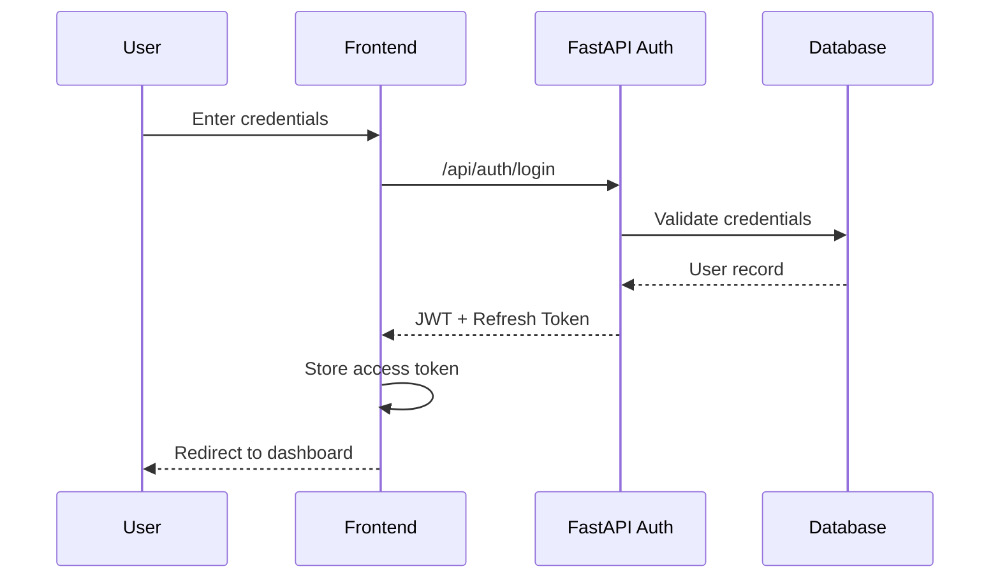
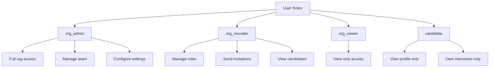
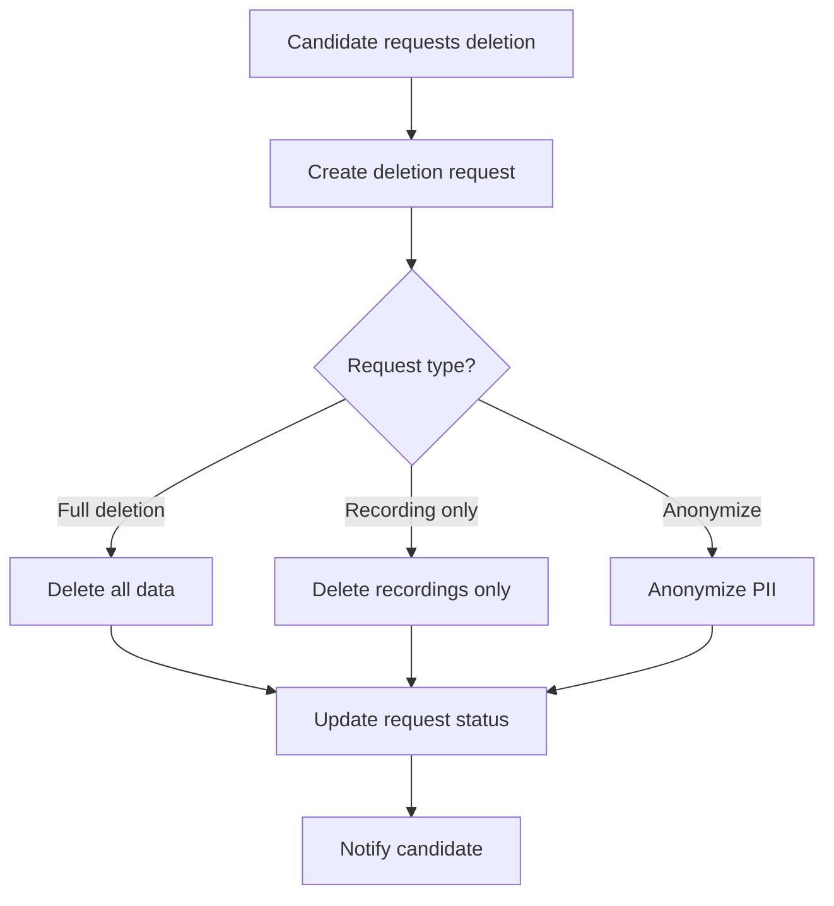

# Talenti Security Documentation

> **Version:** 1.0.0  
> **Last Updated:** January 2026  
> **Classification:** Internal

## Overview

This document outlines security measures, authentication flows, data protection policies, and compliance procedures for the Talenti AI Interview Platform.

---

## Table of Contents

1. [Authentication](#authentication)
2. [Authorization & RLS Policies](#authorization--rls-policies)
3. [Data Protection](#data-protection)
4. [Input Validation](#input-validation)
5. [Rate Limiting](#rate-limiting)
6. [Secrets Management](#secrets-management)
7. [GDPR Compliance](#gdpr-compliance)
8. [Incident Response](#incident-response)
9. [Security Checklist](#security-checklist)

---

## Authentication

### Authentication Flow



### Supported Auth Methods

- **Email/Password**: Standard authentication with password hashing (bcrypt)
- **Magic Links**: Passwordless email authentication
- **Auto-confirm**: Enabled for development (disable in production)

### JWT Token Structure

```json
{
  "sub": "user-uuid",
  "email": "user@example.com",
  "role": "authenticated",
  "aud": "authenticated",
  "exp": 1704067200,
  "iat": 1704063600
}
```

### Token Validation in FastAPI

```python
token = auth_header.replace("Bearer ", "")
payload = jwt.decode(token, settings.jwt_secret, algorithms=["HS256"])
user_id = payload["sub"]
```

### Session Management

- **Token Expiry**: 1 hour (access token)
- **Refresh Token**: 7 days
- **Auto-refresh**: Managed by frontend client
- **Storage**: localStorage (not recommended for high-security apps)

---

## Authorization & RLS Policies

### Role-Based Access Control (RBAC)



### Key RLS Policies

#### Organisations Table
```sql
-- Users can view their organisation
CREATE POLICY "org_members_select" ON organisations
  FOR SELECT USING (
    id IN (
      SELECT organisation_id FROM org_users WHERE user_id = auth.uid()
    )
  );

-- Only admins can update
CREATE POLICY "org_admin_update" ON organisations
  FOR UPDATE USING (
    EXISTS (
      SELECT 1 FROM org_users 
      WHERE user_id = auth.uid() 
        AND organisation_id = id 
        AND role IN ('admin', 'org_admin')
    )
  );
```

#### Job Roles Table
```sql
-- Org members can view roles
CREATE POLICY "org_members_view_roles" ON job_roles
  FOR SELECT USING (
    organisation_id IN (
      SELECT organisation_id FROM org_users WHERE user_id = auth.uid()
    )
    OR 
    status = 'active' -- Public active roles
  );
```

#### Applications Table
```sql
-- Candidates see own applications
CREATE POLICY "candidates_own_applications" ON applications
  FOR SELECT USING (candidate_id = auth.uid());

-- Org members see their org's applications
CREATE POLICY "org_applications" ON applications
  FOR SELECT USING (
    job_role_id IN (
      SELECT id FROM job_roles WHERE organisation_id IN (
        SELECT organisation_id FROM org_users WHERE user_id = auth.uid()
      )
    )
  );
```

#### Candidate Profiles Table
```sql
-- Candidates can CRUD their own profile
CREATE POLICY "candidates_own_profile" ON candidate_profiles
  FOR ALL USING (user_id = auth.uid());

-- Recruiters can view profiles for their org's applicants
CREATE POLICY "recruiters_view_profiles" ON candidate_profiles
  FOR SELECT USING (
    user_id IN (
      SELECT candidate_id FROM applications 
      WHERE job_role_id IN (
        SELECT id FROM job_roles WHERE organisation_id IN (
          SELECT organisation_id FROM org_users WHERE user_id = auth.uid()
        )
      )
    )
  );
```

### Helper Functions

```sql
-- Check if user belongs to organization
CREATE FUNCTION user_belongs_to_org(_org_id uuid, _user_id uuid)
RETURNS boolean AS $$
  SELECT EXISTS (
    SELECT 1 FROM org_users 
    WHERE organisation_id = _org_id AND user_id = _user_id
  );
$$ LANGUAGE sql SECURITY DEFINER;

-- Get user's organization role
CREATE FUNCTION user_org_role(_org_id uuid, _user_id uuid)
RETURNS text AS $$
  SELECT role FROM org_users 
  WHERE organisation_id = _org_id AND user_id = _user_id;
$$ LANGUAGE sql SECURITY DEFINER;
```

---

## Data Protection

### Encryption

| Data Type | At Rest | In Transit |
|-----------|---------|------------|
| Database | SQLite (disk encryption recommended) | TLS 1.3 |
| File Storage | Azure Blob Storage (SSE) | TLS 1.3 |
| Passwords | bcrypt (cost 10) | TLS 1.3 |
| API Keys | Encrypted secrets | TLS 1.3 |

### Sensitive Data Handling

```javascript
// PII fields in candidate_profiles
const PII_FIELDS = [
  'first_name',
  'last_name', 
  'email',
  'phone',
  'suburb',
  'postcode',
  'linkedin_url',
  'portfolio_url'
];

// DEI data (extra sensitive)
const DEI_FIELDS = [
  'gender',
  'ethnicity',
  'disability_status',
  'veteran_status'
];
```

### Data Minimization

- AI matching uses anonymized candidate data (no names, companies)
- Interview scoring excludes PII from transcripts
- Shortlist generation uses skills/experience only

### Recording Retention

```javascript
// Default retention: 60 days
// Configurable per-organisation
const retentionDays = org.recording_retention_days || 60;
```

---

## Input Validation

### Client-Side Validation (Zod)

```typescript
import { z } from 'zod';

const profileSchema = z.object({
  first_name: z.string().trim().min(1).max(100),
  last_name: z.string().trim().min(1).max(100),
  email: z.string().trim().email().max(255),
  phone: z.string().regex(/^\+?[0-9\s-]{8,20}$/).optional(),
});
```

### Server-Side Validation (Edge Functions)

```typescript
// UUID validation
function isValidUUID(str: string): boolean {
  const uuidRegex = /^[0-9a-f]{8}-[0-9a-f]{4}-[0-9a-f]{4}-[0-9a-f]{4}-[0-9a-f]{12}$/i;
  return uuidRegex.test(str);
}

// Path traversal prevention
const sanitizedPath = filePath.replace(/\.\./g, '').replace(/\/\//g, '/');
if (sanitizedPath !== filePath) {
  return error('Path traversal detected');
}

// Ownership verification
if (!filePath.startsWith(`${userId}/`)) {
  return error('Access denied');
}
```

### Webhook Signature Verification

```typescript
function verifyEventGridSignature(body: string, signature: string, secret: string): boolean {
  const hash = createHmac('sha256', secret)
    .update(body)
    .digest('base64');
  
  // Constant-time comparison
  if (hash.length !== signature.length) return false;
  let result = 0;
  for (let i = 0; i < hash.length; i++) {
    result |= hash.charCodeAt(i) ^ signature.charCodeAt(i);
  }
  return result === 0;
}
```

---

## Rate Limiting

### Implementation Pattern

```typescript
const rateLimitStore = new Map<string, { count: number; resetAt: number }>();
const RATE_LIMIT = { windowMs: 60000, maxRequests: 10 };

function checkRateLimit(identifier: string): { isLimited: boolean; resetAt: number } {
  const now = Date.now();
  const entry = rateLimitStore.get(identifier);
  
  if (!entry || entry.resetAt <= now) {
    rateLimitStore.set(identifier, { count: 1, resetAt: now + RATE_LIMIT.windowMs });
    return { isLimited: false, resetAt: now + RATE_LIMIT.windowMs };
  }
  
  if (entry.count >= RATE_LIMIT.maxRequests) {
    return { isLimited: true, resetAt: entry.resetAt };
  }
  
  entry.count++;
  return { isLimited: false, resetAt: entry.resetAt };
}
```

### Rate Limit Tiers

| Tier | Use Case | Strategy |
|------|----------|----------|
| IP-based | Pre-auth protection | By client IP |
| User-based | Post-auth limiting | By user ID |
| Resource-based | Expensive operations | By resource + user |

---

## Secrets Management

### Environment Variables

| Secret | Sensitivity | Rotation |
|--------|-------------|----------|
| `JWT_SECRET` | Critical | Manual |
| `AZURE_ACS_CONNECTION_STRING` | High | Manual |
| `AZURE_SPEECH_KEY` | High | Manual |
| `RESEND_API_KEY` | Medium | Manual |
| `ACS_WEBHOOK_SECRET` | High | On compromise |

### Secret Storage

- **Production**: Secrets manager / key vault (encrypted)
- **Development**: `.env` file (gitignored)
- **Never**: Committed to repository

### Adding Secrets

```javascript
const apiKey = process.env.API_KEY;
if (!apiKey) {
  throw new Error('Required secret not configured');
}
```

---

## GDPR Compliance

### Data Subject Rights

| Right | Implementation |
|-------|----------------|
| Access | Candidate portal shows all stored data |
| Rectification | Profile editing in candidate portal |
| Erasure | Deletion request workflow |
| Portability | Export functionality (planned) |
| Restriction | Profile visibility controls |

### Deletion Request Flow



### Deletion Types

```javascript
// Full deletion - removes everything
async function performFullDeletion(db, userId) {
  // Delete in FK order:
  // 1. transcript_segments
  // 2. score_dimensions  
  // 3. interview_scores
  // 4. interviews (+ recordings from storage)
  // 5. invitations
  // 6. applications
  // 7. practice_interviews
  // 8. candidate_skills
  // 9. education
  // 10. employment_history
  // 11. candidate_dei
  // 12. CV from storage
  // 13. candidate_profiles
  // 14. user_roles
}

// Anonymization - keeps aggregate data
async function anonymizeUserData(db, userId) {
  await db.candidate_profiles.update({
    first_name: 'Anonymized',
    last_name: 'User',
    email: `anonymized-${userId.slice(0,8)}@deleted.local`,
    phone: null,
    linkedin_url: null,
    // ... other PII
  }).eq('user_id', userId);
}
```

### Consent Tracking

- Interview consent recorded before starting
- Profile visibility opt-in/opt-out
- Marketing consent separate (not implemented)

---

## Incident Response

### Severity Levels

| Level | Description | Response Time |
|-------|-------------|---------------|
| P1 Critical | Data breach, service down | Immediate |
| P2 High | Auth bypass, data exposure | < 4 hours |
| P3 Medium | Rate limit bypass, minor vuln | < 24 hours |
| P4 Low | UI security issues | < 1 week |

### Response Procedure

1. **Identify**: Detect and confirm the incident
2. **Contain**: Isolate affected systems/users
3. **Eradicate**: Remove threat/fix vulnerability
4. **Recover**: Restore normal operations
5. **Post-mortem**: Document and learn

### Contact Points

- Security issues: Report via Lovable platform
- Data breaches: Notify affected users within 72 hours (GDPR)
- Audit logs: Retained in `audit_log` table

---

## Security Checklist

### Development

- [ ] All endpoints use JWT validation
- [ ] RLS policies cover all tables
- [ ] Input validation on client and server
- [ ] Rate limiting on all public endpoints
- [ ] Secrets never in code repository
- [ ] Webhook signatures verified

### Deployment

- [ ] Auto-confirm disabled in production
- [ ] Service role key restricted
- [ ] CORS configured correctly
- [ ] TLS enforced
- [ ] Logging enabled

### Operations

- [ ] Regular secret rotation
- [ ] Audit log review
- [ ] Deletion request processing
- [ ] Retention policy execution
- [ ] Security updates applied

---

## Appendix: Audit Log Schema

```sql
CREATE TABLE audit_log (
  id UUID PRIMARY KEY DEFAULT gen_random_uuid(),
  user_id UUID REFERENCES auth.users,
  organisation_id UUID REFERENCES organisations,
  action TEXT NOT NULL, -- 'create', 'update', 'delete', 'login', etc.
  entity_type TEXT NOT NULL, -- 'interview', 'job_role', 'application', etc.
  entity_id UUID,
  old_values JSONB,
  new_values JSONB,
  ip_address TEXT,
  created_at TIMESTAMPTZ DEFAULT now()
);
```

### Logged Actions

- User authentication (login/logout)
- Profile updates
- Application submissions
- Interview completions
- Invitation sends
- Data deletion requests
- Organisation settings changes
