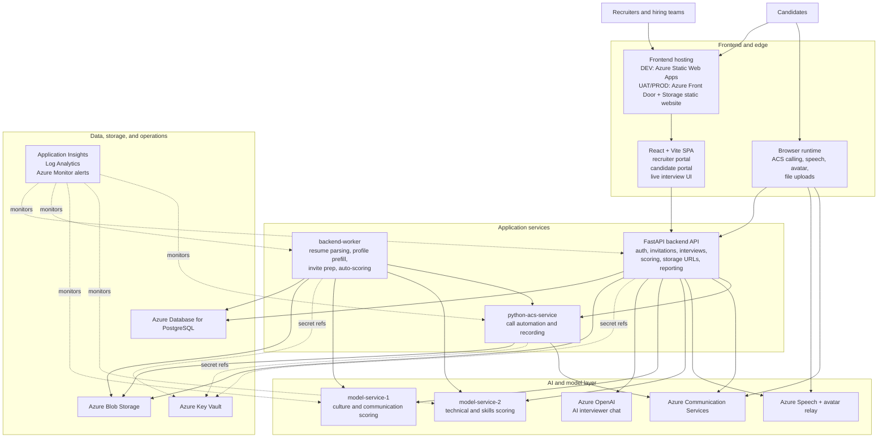
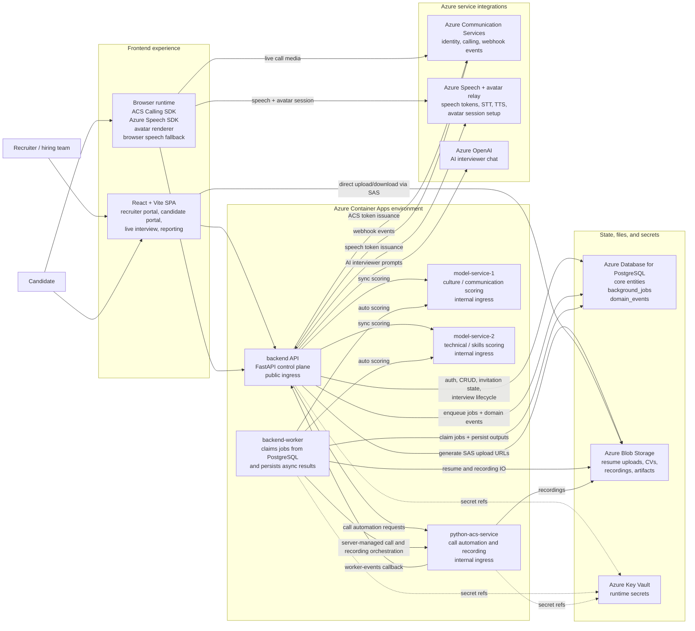
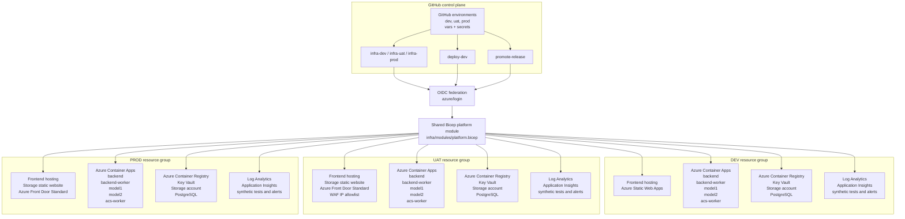
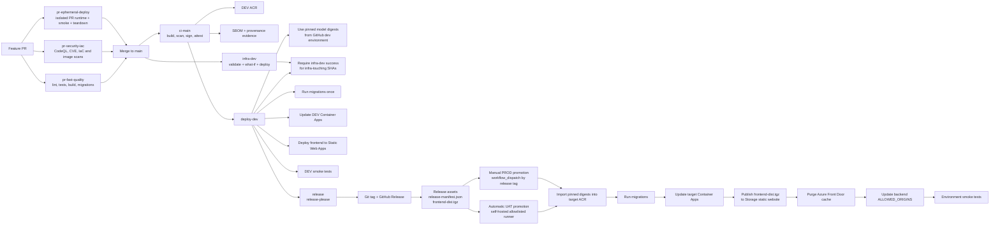

# Talenti Architecture Views

> **Note:** For the canonical auditor-ready architecture documentation, see [ARCHITECTURE_OVERVIEW.md](./ARCHITECTURE_OVERVIEW.md). This diagram document is retained as a supporting visual reference and remains accurate.
>
> **Rendered output:** This file is the Mermaid source. If your Markdown viewer does not render Mermaid, generate the rendered outputs with `npm run docs:arch:html` or `npm run docs:arch:pdf`.

This document refreshes the Talenti diagrams around the Azure-first platform that is now encoded in the repository. It separates the system into four views:

- high-level system design
- runtime topology
- environment and infrastructure layout
- delivery and promotion flow

## Source Of Truth

These diagrams are based on:

- [`infra/modules/platform.bicep`](../infra/modules/platform.bicep)
- [`infra/dev/main.bicep`](../infra/dev/main.bicep)
- [`infra/uat/main.bicep`](../infra/uat/main.bicep)
- [`infra/prod/main.bicep`](../infra/prod/main.bicep)
- [`pr-fast-quality.yml`](../.github/workflows/pr-fast-quality.yml)
- [`pr-security-iac.yml`](../.github/workflows/pr-security-iac.yml)
- [`pr-ephemeral-deploy.yml`](../.github/workflows/pr-ephemeral-deploy.yml)
- [`ci-main.yml`](../.github/workflows/ci-main.yml)
- [`deploy-dev.yml`](../.github/workflows/deploy-dev.yml)
- [`release.yml`](../.github/workflows/release.yml)
- [`promote-release.yml`](../.github/workflows/promote-release.yml)
- [`backend/app/main.py`](../backend/app/main.py)
- [`backend/app/services/job_handlers.py`](../backend/app/services/job_handlers.py)

The older local `docker-compose` setup remains useful for development, but it is no longer the primary source of truth for deployed architecture.

## 1. High-Level System Design

This is the quickest view to use when we want to explain the platform in one diagram.

### System Design Notes

- The frontend is a single SPA, but the hosting pattern changes by environment: Static Web Apps in `dev`, Storage static website plus Front Door in `uat` and `prod`.
- The backend is the control plane for platform state, while `backend-worker` handles database-backed async orchestration.
- The model services remain separate runtime resources so scoring can evolve independently from the main backend.
- Azure Speech, avatar features, and Azure Communication Services are used both through backend-issued tokens and direct browser sessions.
- PostgreSQL, Blob Storage, Key Vault, and Azure-native monitoring form the shared platform foundation across all environments.

## 2. Runtime Topology

### Runtime Notes

- Only `backend` has public ingress in the deployed Container Apps environment.
- `backend-worker`, `model-service-1`, `model-service-2`, and `python-acs-service` are internal services.
- Async orchestration is database-backed through `background_jobs` and `domain_events`; there is no separate queue broker in the current platform.
- Blob Storage is the canonical deployed upload and recording store. `/api/v1/candidates/cv` remains only as a local fallback when blob configuration is absent.
- The backend can score interviews synchronously through `/api/v1/scoring/analyze`, while `backend-worker` can also run asynchronous scoring when `AUTO_SCORE_INTERVIEWS` is enabled.

## 3. Environment And Infrastructure Topology

### Environment Notes

- Each stage is a separate Azure resource group with its own Container Apps environment, ACR, Key Vault, Storage account, PostgreSQL server, Log Analytics workspace, Application Insights component, and alert rules.
- `dev` serves the SPA from Azure Static Web Apps.
- `uat` and `prod` serve the SPA from Azure Storage static website hosting behind Azure Front Door Standard.
- `uat` adds a Front Door WAF IP allowlist so promotion and smoke checks must run from an allowlisted network.
- After infra deployment, the workflows assign `AcrPull` and `Key Vault Secrets User` to the five Container Apps so images and secret references work without embedded credentials.

## 4. Delivery And Promotion Architecture

### Pipeline Notes

- Required PR gates are `pr-fast-quality`, `pr-security-iac`, and `pr-ephemeral-deploy`.
- `ci-main` builds backend and ACS worker images once per `main` SHA, then scans, signs, and attests those immutable artifacts.
- `deploy-dev` deploys immutable backend/ACS digests for the source SHA and enforces `infra-dev` success for infra-touching commits.
- `release.yml` is triggered only after successful `deploy-dev` on `main`, so release creation starts after DEV deployment validation.
- `release-manifest.json` is the promotion handoff. It captures backend, ACS worker, and model image digests plus the frontend source SHA.
- `promote-release.yml` does not rebuild application artifacts for UAT or PROD. It imports pinned images into the target ACR, verifies signatures, and reuses the packaged frontend artifact.
- UAT is auto-promoted from a published release. PROD is promoted manually by release tag.

## Summary

The platform is now best understood as an Azure Container Apps control plane with PostgreSQL-backed orchestration, Blob-backed file storage, and GitHub Actions-managed promotion between isolated Azure environments. The key architectural distinction from the older diagrams is that deployment automation, environment isolation, and immutable release promotion are now first-class parts of the system design, not side notes.
