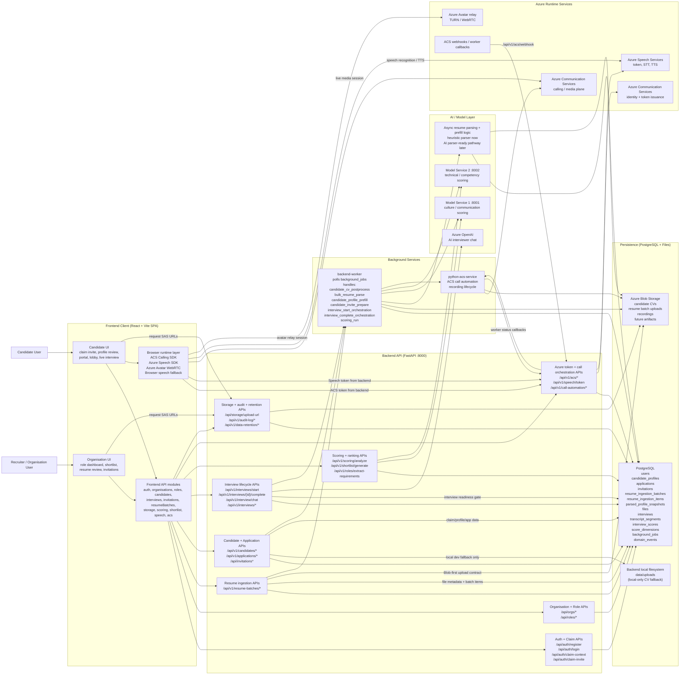
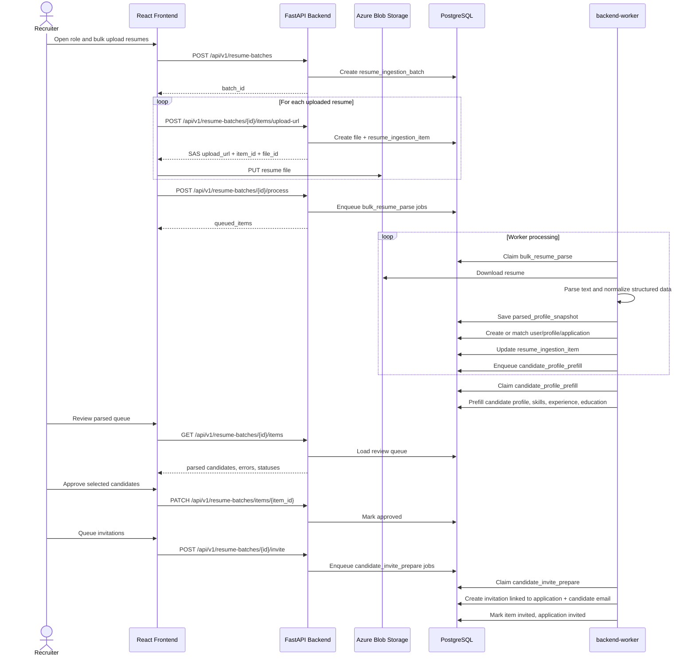
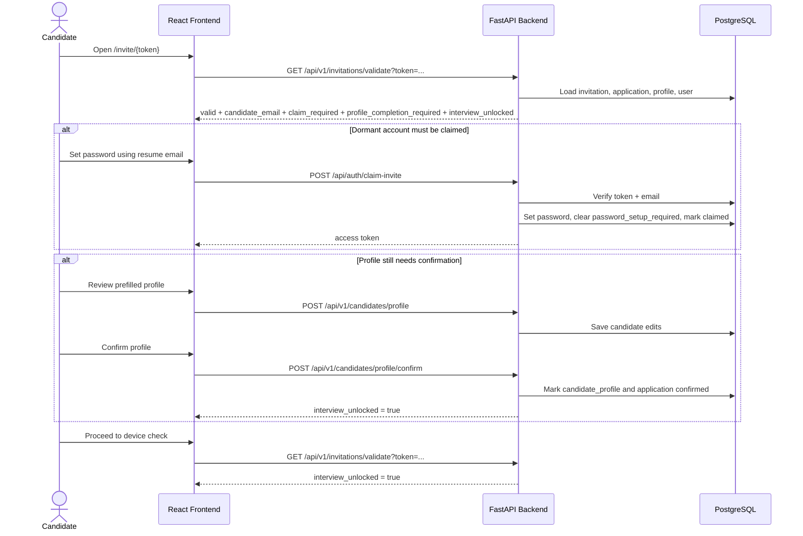
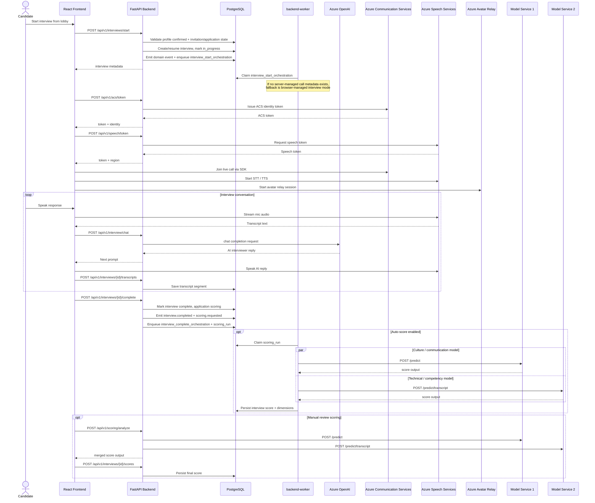

# Talenti Application Architecture Diagram

This draft reflects the platform as it currently stands across:

- [documentation/ENV_SETUP.md](/c:/Users/Declan/Downloads/TalentiMatchFrontend/Talenti_MVP/documentation/ENV_SETUP.md)
- [INTEGRATION_GUIDE.md](/c:/Users/Declan/Downloads/TalentiMatchFrontend/Talenti_MVP/INTEGRATION_GUIDE.md)
- The frontend API modules in [`src/api`](/c:/Users/Declan/Downloads/TalentiMatchFrontend/Talenti_MVP/src/api)
- The FastAPI routes in [`backend/app/api`](/c:/Users/Declan/Downloads/TalentiMatchFrontend/Talenti_MVP/backend/app/api)
- The worker/runtime services in [`backend/app/services`](/c:/Users/Declan/Downloads/TalentiMatchFrontend/Talenti_MVP/backend/app/services)
- The deployment topology in [docker-compose.yml](/c:/Users/Declan/Downloads/TalentiMatchFrontend/Talenti_MVP/docker-compose.yml)

## Mermaid Diagram

## Current-State Notes

- The backend is the control plane for auth, candidate/application state, invitations, interview lifecycle, scoring orchestration, storage URL issuance, and worker job creation.
- Blob Storage is now the canonical upload path in deployed environments for both self-serve candidate CV uploads and organisation bulk resume ingestion.
- `/api/v1/candidates/cv` still exists only as a local-development fallback when Blob Storage is not configured.
- Resume ingestion is now a first-class platform capability:
  - recruiters create role-linked `resume_ingestion_batches`
  - files are uploaded to Blob
  - each file becomes a `resume_ingestion_item`
  - parsing results are stored in `parsed_profile_snapshots`
  - candidate user/profile/application records are matched or created
- Organisation-uploaded candidates can now exist as dormant accounts before the candidate has ever visited the platform.
- Dormant invited candidate accounts are keyed by resume email and require `claim-invite` before normal login is allowed.
- Invitation validation now returns claim state, profile-confirmation state, and interview unlock state.
- The AI interview is gated by:
  - valid invitation
  - account claimed when required
  - profile confirmation completed when required
- Candidate profile confirmation is now an explicit lifecycle step before interview start for prefilled invite flows.
- Candidate CV upload and organisation bulk resume upload both feed the same async prefill architecture through `background_jobs`.
- `backend-worker` is now the general async platform worker; `python-acs-service` remains specialized for ACS call and recording tasks.
- Async scoring scaffolding is present through `scoring_run`, while synchronous `/api/v1/scoring/analyze` remains available.
- Resume parsing is currently a best-effort backend parser with PDF/DOCX/text extraction and structured prefill logic. The architecture is intentionally ready for a future AI parser to replace or augment this layer.

## Sequence Diagram: Bulk Resume Ingestion and Invite Preparation

## Sequence Diagram: Candidate Claim, Profile Confirmation, and Interview Unlock

## Sequence Diagram: Live Interview and Scoring Flow

## Implementation Notes

- `call-automation` is not treated as a normal user-facing frontend surface. Candidate interview start triggers orchestration, and any server-managed call work stays behind the backend and workers.
- The frontend now directly uses `/api/v1/resume-batches/*` for recruiter bulk upload/review and `/api/auth/claim-invite` plus `/api/v1/candidates/profile/confirm` for the prefilled candidate invite flow.
- The current recruiter bulk upload UI queues invite preparation but does not yet include outbound email delivery infrastructure in the repo; invitation records and tokens are created and stored.
- Because candidate accounts are keyed by resume email, invitation messaging should continue to instruct invited candidates to use the email address from their resume when claiming the account.
- The architecture now clearly separates:
  - synchronous control-plane APIs
  - DB-backed async orchestration in `backend-worker`
  - specialized ACS media/call handling in `python-acs-service`
  - browser-direct media/speech runtime traffic to Azure
