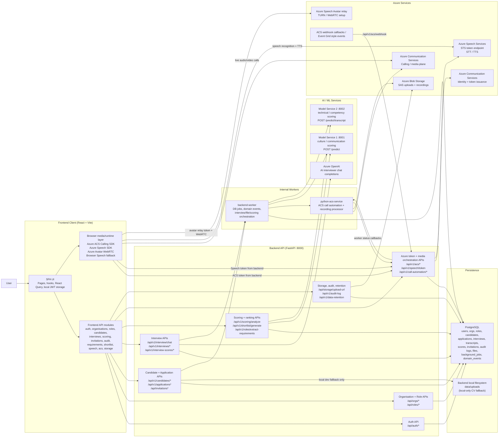
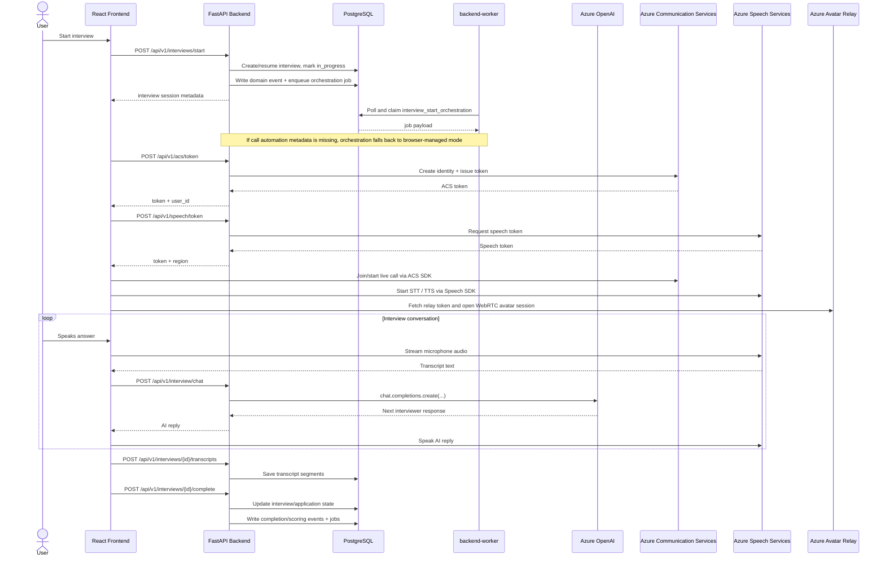
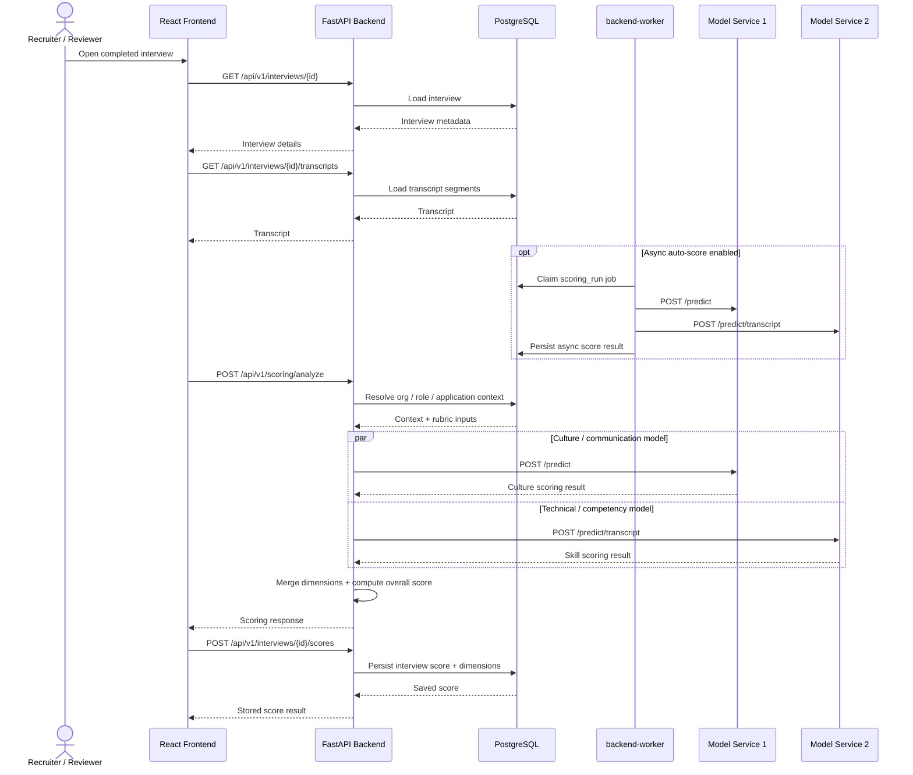

# Talenti Application Architecture Diagram

This draft is based on:

- [documentation/ENV_SETUP.md](/c:/Users/Declan/Downloads/TalentiMatchFrontend/Talenti_MVP/documentation/ENV_SETUP.md)
- [INTEGRATION_GUIDE.md](/c:/Users/Declan/Downloads/TalentiMatchFrontend/Talenti_MVP/INTEGRATION_GUIDE.md)
- The frontend API modules in [`src/api`](/c:/Users/Declan/Downloads/TalentiMatchFrontend/Talenti_MVP/src/api)
- The FastAPI routes in [`backend/app/api`](/c:/Users/Declan/Downloads/TalentiMatchFrontend/Talenti_MVP/backend/app/api)
- The deployment topology in [docker-compose.yml](/c:/Users/Declan/Downloads/TalentiMatchFrontend/Talenti_MVP/docker-compose.yml)

## Mermaid Diagram

## Notes

- Frontend API traffic goes through `VITE_API_BASE_URL`, which points at the FastAPI backend.
- JWT auth is issued by FastAPI and stored client-side for subsequent API requests.
- Interview chat uses Azure OpenAI only through the backend.
- Interview scoring fans out from the backend to both model microservices, then combines their outputs.
- The live interview experience uses backend-issued ACS and Speech tokens, but the browser talks directly to Azure runtime services for media, speech, and avatar streaming.
- Candidate CV upload is Blob-first in deployed environments via `/api/storage/upload-url`; `/api/v1/candidates/cv` remains as a local-development fallback.
- Azure Blob Storage is used by the frontend upload flow and by the ACS worker for processed call recordings.
- `backend-worker` processes `background_jobs` and `domain_events` for interview start/completion orchestration, placeholder CV post-processing, and optional async scoring.
- The `python-acs-service` worker remains dedicated to ACS call automation and recording lifecycle events; the backend receives both worker callbacks and ACS webhook events.
- Current frontend API modules directly call `/api/storage/upload-url` for CV upload and `/api/v1/interviews/start` / `/complete` for candidate interview lifecycle actions. Call automation remains internal orchestration.

## Sequence Diagram: Live Interview Flow

## Sequence Diagram: Scoring Pipeline

