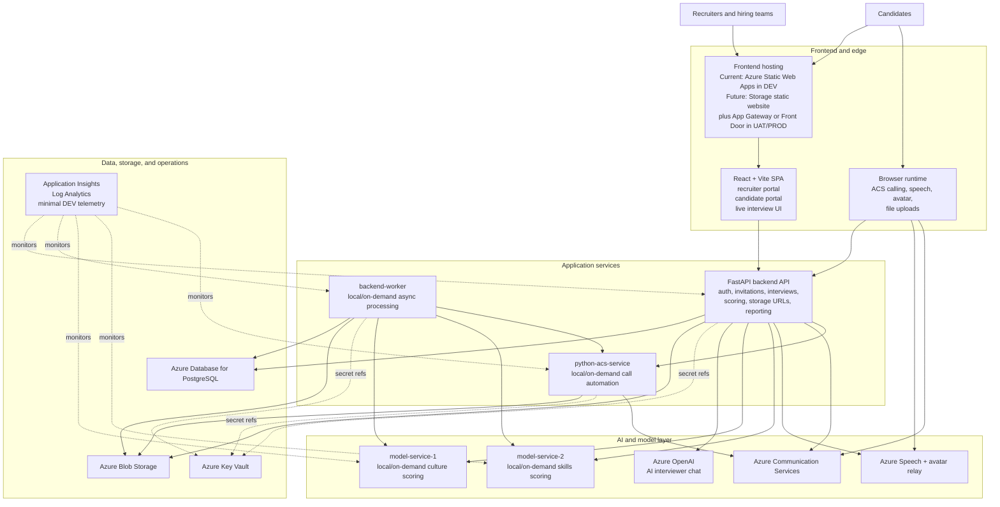
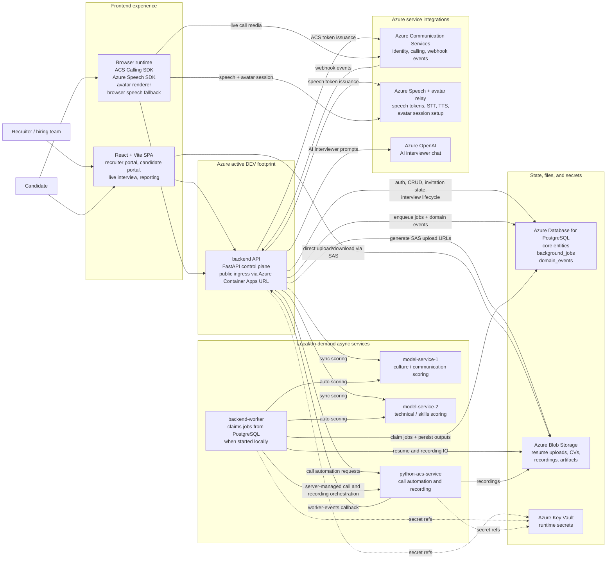
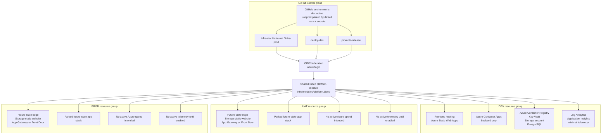
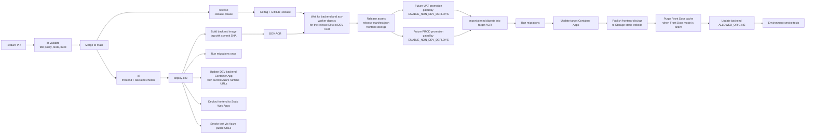

# Talenti Architecture Views

This document refreshes the Talenti diagrams around the Azure-first platform that is now encoded in the repository. It separates the system into four views:

- high-level system design
- runtime topology
- environment and infrastructure layout
- delivery and promotion flow

## Source Of Truth

These diagrams are based on:

- [`infra/modules/platform.bicep`](../infra/modules/platform.bicep)
- [`infra/dev/main.bicep`](../infra/dev/main.bicep)
- [`infra/uat/main.bicep`](../infra/uat/main.bicep)
- [`infra/prod/main.bicep`](../infra/prod/main.bicep)
- [`deploy-dev.yml`](../.github/workflows/deploy-dev.yml)
- [`release.yml`](../.github/workflows/release.yml)
- [`promote-release.yml`](../.github/workflows/promote-release.yml)
- [`backend/app/main.py`](../backend/app/main.py)
- [`backend/app/services/job_handlers.py`](../backend/app/services/job_handlers.py)

The older local `docker-compose` setup remains useful for development, but it is no longer the primary source of truth for deployed architecture.

## 1. High-Level System Design

This is the quickest view to use when we want to explain the platform in one diagram.

### System Design Notes

- The currently active cloud environment is `dev`, exposed on raw Azure hostnames and hosted on Azure Static Web Apps plus one backend Container App.
- The backend is the cloud control plane for platform state, while `backend-worker` now runs locally/on demand when developers need queued async orchestration.
- The model services remain separate runtimes, but they are intentionally local/on-demand in the current cost-controlled phase.
- Azure Speech, avatar features, and Azure Communication Services are used both through backend-issued tokens and direct browser sessions.
- PostgreSQL, Blob Storage, Key Vault, and Azure-native monitoring form the shared platform foundation, with only the `dev` instance active today.

## 2. Runtime Topology

### Runtime Notes

- Only `backend` is always on in Azure today, exposed on its Azure Container Apps hostname.
- `backend-worker`, `model-service-1`, `model-service-2`, and `python-acs-service` are local/on-demand services in the current dev-only footprint.
- Async orchestration is database-backed through `background_jobs` and `domain_events`; there is no separate queue broker in the current platform.
- Blob Storage is the canonical deployed upload and recording store. `/api/v1/candidates/cv` remains only as a local fallback when blob configuration is absent.
- Lean cloud dev keeps live scoring and call automation disabled by default so missing local services fail fast with explicit `503` responses.

## 3. Environment And Infrastructure Topology

### Environment Notes

- `dev` is the only active Azure environment right now: Static Web Apps for the frontend, one backend Container App, PostgreSQL, Storage, Key Vault, ACR, Log Analytics, and Application Insights.
- Current public demo access uses the Azure-generated hostnames rather than Cloudflare or custom domains.
- `uat` and `prod` stay in the repo as future-state templates, but their workflows are gated off by `ENABLE_NON_DEV_DEPLOYS=false` by default.
- The future `uat`/`prod` edge can still use Azure Application Gateway or Azure Front Door when the project is ready to pay for and operate that layer.
- After infra deployment, the workflows assign `AcrPull` and `Key Vault Secrets User` to the active Container App identity so images and secret references work without embedded credentials.

## 4. Delivery And Promotion Architecture

### Pipeline Notes

- `deploy-dev` now builds and deploys only the backend from this repository, then repoints runtime URLs to the current Azure public hostnames.
- `release.yml` still creates release assets, but non-dev promotion remains parked until `ENABLE_NON_DEV_DEPLOYS` is explicitly enabled for the target environment.
- `release-manifest.json` is the promotion handoff. It captures backend, ACS worker, and model image digests plus the frontend source SHA.
- `promote-release.yml` does not rebuild application artifacts for UAT or PROD. It imports pinned images into the target ACR and reuses the packaged frontend artifact.
- UAT and PROD promotion stay dormant by default in the current dev-only operating mode.

## Summary

The platform is now best understood as a lean Azure dev control plane: Static Web Apps plus a single backend Container App in Azure, PostgreSQL-backed orchestration, Blob-backed file storage, and optional local/on-demand async services. The future multi-environment promotion path is still represented in the repo, but it is intentionally parked until the product is ready for that spend and operating model.
